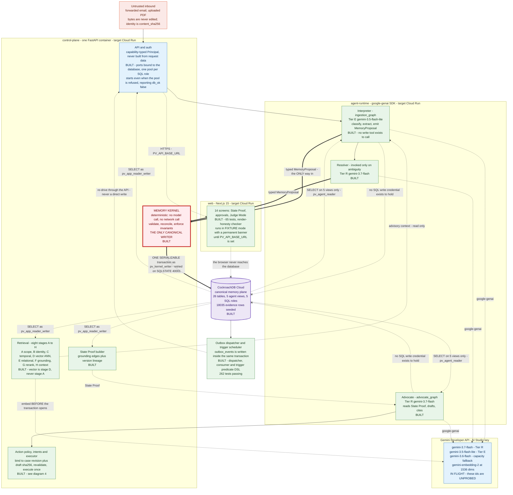
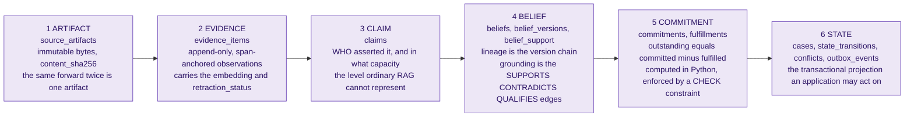
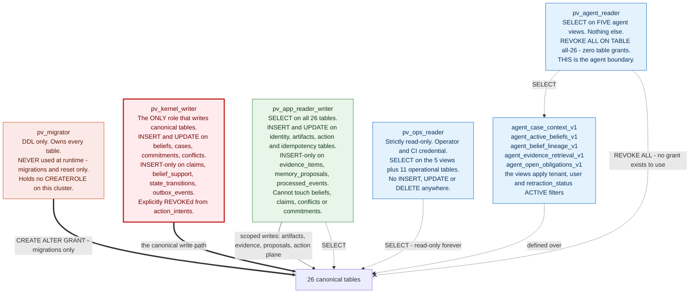
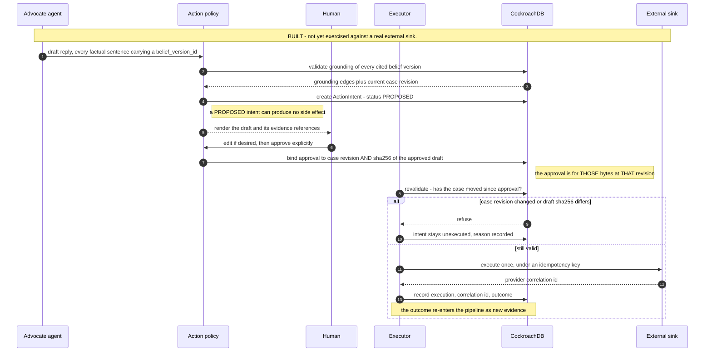
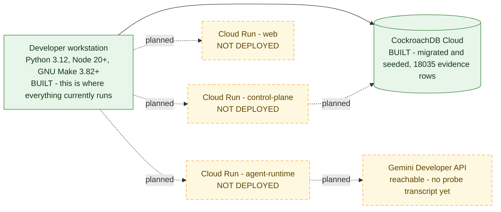

# Provenance — architecture diagrams

Submission artifact for the **All Things Agentic Hackathon** (deadline
2026-08-31, 17:00 PDT).

Mermaid source. GitHub renders it inline; `docs/diagrams/README.md` covers other
renderers and the conventions these diagrams follow.

**Read this first.** These diagrams distinguish three states and never blur them:

| Badge | Meaning |
|---|---|
| `BUILT` | Exists in this tree, has tests, and the tests run. |
| `IN FLIGHT` | Partly in the tree; the named gaps are listed under the diagram. |
| `NOT BUILT` | Does not exist. Drawn only where omitting it would misrepresent the shape of the system. |

Nothing carries `BUILT` that this repository cannot demonstrate. A diagram that
claims unbuilt capability is exactly the dishonesty this project's gate system
exists to prevent, so the badges are part of the diagram, not decoration around
it.

Authorities, in precedence order: `docs/CANONICAL_DECISIONS.md` (frozen; it
outranks every other document), `docs/implementation/00_IMPLEMENTATION_MAP.md`
§2/§4/§5, `docs/00_PRODUCT.md` §0–§2, `docs/ARCHITECTURE.md` §7/§9/§11/§17/§22,
`STATUS.md`, `PIVOT.md`.

---

## 1. The system, and the one door into canonical memory

The single most important claim in this architecture: **the deterministic Memory
Kernel is the only thing that writes canonical state.** Agents propose typed
`MemoryProposal` objects. No agent holds a SQL write credential — not a
restricted one, not a scoped one, none. That is enforced twice: by the SQL grants
in migration `0008` at runtime, and by `tools/write_path_lint.py` at review time.

In the diagram below there is exactly **one** thick arrow into the database.
Every other path into it is a dotted read. The two crossed arrows are refusals,
not omissions.

### What that diagram claims, and what backs each claim

| Claim | How it is checked |
|---|---|
| The Kernel is the only canonical writer | `python -m tools.write_path_lint` — measured on this tree: *5 rules, 0 violations; 23 canonical write statements, 17 of them in the Kernel; `agents/` 0, `workers/` 0, `apps/web/` 0, `packages/` 0*. The Kernel's seventeen are **named** in `memory_kernel/transaction.CANONICAL_WRITE_STATEMENTS`, so the count is a claim about specific statements rather than a constant nobody re-measures. The other six are all `UPDATE outbox_events` in `app/events/dispatcher.py` — claim, mark-dispatched, mark-failed, mark-dead, reclaim-lease, replay — permitted by rule `W5-outbox-UPDATE-is-dispatcher-permitted`, because they move a dispatch status field on an already-committed event rather than canonical epistemic state. (`processed_events` is **not** in the linter's `CANONICAL_TABLES`; it belongs to `pv_app_reader_writer` outright, so `consumer.py`'s update is not counted at all.) |
| The agent layer holds no write capability | `agents/runtime/tests/test_no_write_tools.py` — enumerates the tool protocols, walks the AST of every shipped agent module for canonical write vocabulary and for the two writer SQL roles, and runs 12 injected adversarial artifacts end to end asserting *kernel commits caused: 0, action intents created: 0, scopes escalated: 0* — with a positive control that every injected artifact is still admitted as evidence, because silently dropping the text would break the append-only invariant while looking like a pass. |
| Agents cannot write, by grant rather than by prompt | Migration `0008` issues `GRANT SELECT` on the five `agent_*_v1` views to `pv_agent_reader`, then `REVOKE ALL ON TABLE <all 26> FROM pv_agent_reader`. |
| The commit is one transaction | `services/control_plane/app/memory_kernel/transaction.py` — `SERIALIZABLE`, bounded retry on SQLSTATE `40001`. |
| No model or network call inside that transaction | `python -m tools.txn_purity_lint services packages workers`, wired into `make lint`. |
| Vector search is stage D, not stage A | `STAGES` in `services/control_plane/app/retrieval/pipeline.py`, asserted by a test rather than left as a comment. |
| Every invariant names a test that actually runs | `python -m tools.invariant_map_check packages/python/provenance_domain/INVARIANTS.md` — *5 invariants, 5 mapped, 0 UNPROVEN*. |

### The honest gaps in diagram 1

- **The agent layer is new and its model calls are unexercised.**
  `agents/runtime/` is now ~9,500 lines — ingestion and advocate graphs, the
  resolver, the Gemini model router, typed schemas — and **252 tests pass**. But
  every one of those runs against fakes. No graph has executed against a live
  Gemini endpoint, because there is no API key on this machine. The structure is
  proved; the integration is not.
- **The event plane went green while this file was being written.** The trigger
  predicate parser had 19 failing tests an hour before this edit and now has
  none: `services/control_plane/tests/events` is 262 passing, `actions` 74,
  `agents/runtime` 252. Treat every count in this document as a timestamp rather
  than a fact, and re-run the command instead of quoting the number.
- **The Gemini model ids are UNPROBED.** `ops/probes/gemini_probe.py` exists;
  `ops/gemini-probe.txt` currently records `CANNOT RUN — GOOGLE_API_KEY is not
  set`. Every id above is transcribed from documentation. The last time this
  project froze model ids from documentation, all of them were wrong.
  `CANNOT RUN` is recorded distinctly from `FAIL`, because the two lead to
  opposite decisions.
- **The vectors in `evidence_items` are Titan vectors at 1024 dimensions**, not
  Gemini vectors at 1536. Migration `0009_gemini_embedding_plane` widens the
  column to `VECTOR(1536)`, repoints both model `CHECK` constraints to the
  Gemini ids, and **nulls every embedding** — a 1024-dimension vector is not a
  truncation of a 1536-dimension one. The rows, their text, their hashes and
  their grounding edges survive; the vectors do not. The Gemini re-embed that
  refills them is in flight, and until it lands retrieval returns nothing,
  because the canonical query filters `embedding_version = 'v2'`.
- **Nothing is deployed to Cloud Run.** "target Cloud Run" means exactly that: a
  target. No container has been built or pushed. This is the one gap on this
  list that no amount of local work closes.
- **A running control plane does not imply a reachable database.**
  `build_dependencies()` no longer raises, and `make run-api` starts a real
  server — but startup deliberately survives a refused pool and reports
  `db_ok: false` on `GET /v1/version` rather than crash-looping. A `200` from
  that endpoint is therefore not evidence of a database; the `db_ok` field is.

---

## 2. The data spine — the six-way separation

This is the idea. Ordinary retrieval-augmented generation has one level of
representation — the chunk — and resolves a contradiction by cosine similarity.
Provenance keeps six levels apart: each is a distinct table, a distinct
lifecycle, and a distinct authority to change things.

All six levels are `BUILT` in the schema: migrations `0001`–`0008`, 26 tables.
Migration `0009` widens the evidence vector for Gemini and is authored but not
yet paired with a re-embed.

The worked example, from `docs/00_PRODUCT.md` §2.3: an ISP invoice for USD 186
arriving four months after the same ISP confirmed termination in writing does
**not** make USD 186 owed. It makes USD 186 *claimed*, by a party with a
financial interest, covering a period that begins after a termination that
party's own documents establish. Every one of those qualifiers is a column, not
a sentence in a summary.

The consequence is that `balance_owed` gets a new belief version whose **value is
unchanged at USD 0** and whose **`epistemic_status` moves `CONFIRMED` to
`DISPUTED`**. Prose cannot express that. A version chain plus grounding edges
can, and the `conflicts` row that records it is queryable, countable and
displayable rather than implicit.

---

## 3. The four SQL roles, ordered by privilege

The permission boundary is the grant, not the prompt. `pv_agent_reader` is not
asked nicely to stay out of the base tables; it holds zero grants on them.

Privilege ordering, strongest to weakest, with the rule that goes with each:

1. **`pv_migrator`** — DDL only. Owns the tables. Never appears in a runtime
   connection string.
2. **`pv_kernel_writer`** — the only role permitted to write canonical epistemic
   and state tables. Held by exactly one module.
3. **`pv_app_reader_writer`** — reads everything; writes only the non-canonical
   surface: identity, artifacts, evidence admission, proposals, the action plane.
4. **`pv_agent_reader`** — `SELECT` on five views, zero table grants.
5. **`pv_ops_reader`** — read-only operator credential. Listed for completeness
   because it exists in migration `0008`, and because an undocumented role is a
   role nobody revokes.

Source: `db/migrations/versions/0008_events_infrastructure.py`, constants
`RUNTIME_ROLES`, `AGENT_VIEWS`, `CANONICAL_TABLES` and `GRANT_DDL`.

---

## 4. The human-approval gate on external actions — `BUILT`

`services/control_plane/app/actions/` is ~3,100 lines across nine modules:
`policy`, `drafts`, `intents`, `executor`, `support_validation`, `sink`, and two
stores. `basis_case_revision`, `draft_sha256`, revalidation and idempotency all
appear in the implementation, not only in the contract.

The sequence below is the frozen contract from `docs/CANONICAL_DECISIONS.md` →
*Memory, action, and time* → *External action*. The schema encodes the same
commitment: `action_intents` and `action_executions` are two of the 26 tables,
and `pv_kernel_writer` is explicitly **revoked** from `action_intents` so the
Kernel itself cannot arm an action.

What is **not** proved: no intent has been executed against a real external
sink. `sink.py` exists and the demo-safe path is the intended one, but an
end-to-end send has not been demonstrated.

Why revalidation exists: an approval not bound to a specific `case.revision` and
a specific `sha256` approves a *situation*, and situations move. Binding to both
lets the executor prove that the thing it is about to send is the thing a human
read.

---

## 5. What is deployed

Nothing. The build runs on a workstation against a live CockroachDB Cloud
cluster.

The prior build's ten AWS CDK stacks — 170 resources, 304 synthesis tests — are
discarded by the pivot and are not drawn. They synthesised; they were never
deployed either. The *reasoning* inside them (least privilege, immutable image
tags, alarms with `treatMissingData` set so a quiet system reports `OK` rather
than nothing) is what should carry across to the Google Cloud equivalent, rather
than being rediscovered.

---

## Sources

- `docs/CANONICAL_DECISIONS.md` — the frozen register; outranks every other document
- `docs/implementation/00_IMPLEMENTATION_MAP.md` §2, §4, §5
- `docs/00_PRODUCT.md` §0, §1, §2
- `docs/ARCHITECTURE.md` §7, §9, §11, §17, §22 — pre-pivot in its AWS specifics; the service boundaries survive the pivot
- `db/migrations/versions/0008_events_infrastructure.py` — roles, grants, views
- `services/control_plane/app/` — the code the badges describe
- `STATUS.md`, `PIVOT.md` — measured build state
