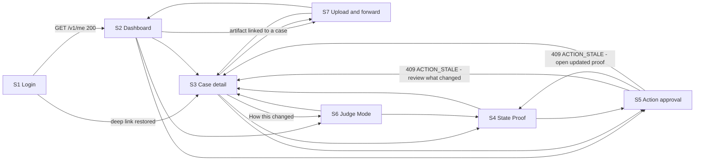

# Provenance — Functional UX Specification

Purpose: define the behaviour, state, and data binding of every screen in the Provenance web application, so that a competent frontend engineer can build it against `specs/15_API_SPEC.md` without asking a question.

Status: planning complete v1.1
Implementation status: not started

Audience: frontend engineers implementing `apps/web`; backend engineers who need to know which response fields are load-bearing in the UI; the designer receiving `frontend/31_DESIGN_BRIEF_FOR_OPUS5.md`; accessibility reviewers; and judges auditing whether the interface tells the truth about the system behind it.

Product: **Provenance** — a system of record for the institutions that already have one of you.

---

## 0. Scope, authority, and what this document deliberately omits

### 0.1 Authority

This document is subordinate to, in order: `00_PRODUCT.md`, `CANONICAL_DECISIONS.md`, then the owning numbered specification for each technical concern — principally `specs/15_API_SPEC.md` for every endpoint, field name, error code, and header used below. Where this document names a field, that name is copied from `15_API_SPEC.md` and must not be renamed in the client. Where this document appears to add a runtime semantic, it does not: it is describing how an existing contract is rendered.

Three terms are load-bearing and are never collapsed, in prose, in component names, in test ids, or in user-facing copy:

- **Provenance** — the product. Always a proper noun. Never used as a common noun anywhere in `apps/web`, including comments, type names, and CSS class names. The permitted plain-English gloss in user copy is "chain of custody" (`00_PRODUCT.md` §4.4).
- **grounding** — the `belief_support` edges linking a belief version to the evidence and claims that `SUPPORTS`, `CONTRADICTS`, or `QUALIFIES` it.
- **lineage** — the `belief_versions` supersession chain and the reason codes for each change.

The State Proof screen renders **both**, in two visually and semantically separate regions, and never merges them.

### 0.2 What this document specifies

Behaviour, state, and data. For every screen: purpose, endpoint call order, every response field rendered and where, every state, every user action and its resulting request, navigation edges, and loading strategy.

### 0.3 What this document does not specify

Visual design — colour, type scale, spacing, illustration, motion language, brand. Those are commissioned separately in `frontend/31_DESIGN_BRIEF_FOR_OPUS5.md`. This document sets constraints the design must satisfy (contrast floors, non-colour-only encoding, required labels, required document order) but does not choose the aesthetic that satisfies them.

It also does not specify the component library, CSS approach, or state-management library. It specifies *behaviour* those choices must produce. Where a snippet below is written in a particular idiom, the idiom is illustrative; the behaviour is normative.

### 0.4 Nothing here exists yet

No code, no deployed page, no test run, no screenshot. Every "must" is a requirement on work not yet started.

---

## 1. The six hard rules

These bind every screen. A violation of any of them is a correctness bug, not a design preference.

### R1 — Canonical state renders before any model-generated prose

No route may block its first contentful paint on a request that can return model-authored text. Every screen paints from deterministic endpoints first; model-authored regions are separate suspense boundaries that resolve later and are visually and semantically subordinate.

### R2 — Every string on screen declares its origin

Three origins exist and every rendered text node belongs to exactly one:

| `TextOrigin` | Meaning | Examples |
|---|---|---|
| `CANONICAL` | A value read directly from canonical state. | `cases.status`, `revision`, `outstanding_amount`, `epistemic_status`, `exact_text` of an evidence row, `draft_sha256`. |
| `DETERMINISTIC_TEMPLATE` | Rendered server-side or client-side by a template keyed on enum values and reason codes. No model involved. | `/v1/dashboard` `headline`, `/v1/cases/{id}/timeline` `headline`, `conflicts[].summary`, `triggers[].predicate_summary`, `ACTION_STALE` `changed_since[].summary`. |
| `MODEL_AUTHORED` | Produced by a Bedrock model. | `action_intents.draft.subject`, `draft.body`, `rationale`, `draft.unresolved_risks[]`, counterfactual `output.headline`, `output.draft_text`, `why`. |

`MODEL_AUTHORED` content is always wrapped and always labelled. `CANONICAL` and `DETERMINISTIC_TEMPLATE` are never labelled as generated, because they are not.

### R3 — A claim is never rendered as a fact

An assertion by an actor is rendered with mandatory attribution, in reported speech, inside a claim container, with its `claim_kind` visible. A canonical belief or commitment is rendered declaratively. The distinction is carried by text and structure, never by colour alone. §15 specifies this exhaustively; every screen section restates the specific places it applies.

### R4 — Identifiers are content, not debug output

`revision`, `belief_version_id`, `support_ids`, `draft_sha256`, `trace_id`, `kernel_decision_id`, `conflict_id` are rendered as visible, selectable, copyable content wherever the corresponding object is rendered. They are what makes the record citable. They are not hidden behind a developer toggle.

### R5 — The client contains no hard-coded domain identifiers

No UUID literal, no case title, no counterparty name, no headline sentence appears in `apps/web/src`. Every identifier the client uses is obtained from a prior API response in the same session. This is enforced by gate `G12.3` and extended by the lint in §14.6. A hard-coded id is a rendered lie.

### R6 — Chat is not the primary UX, and in v1 there is no chat surface at all

§16 argues this at length. Operationally: there is no message list, no conversational input, and no free-text box whose contents are interpreted as an instruction. The three natural-language inputs that exist are typed fields on typed forms (§16.3).

---

## 2. Information architecture and navigation

### 2.1 Routes

```text
apps/web/src/app/
  (auth)/login/page.tsx                          S1  /login
  auth/callback/route.ts                         —   /auth/callback     (code exchange, no UI)
  (app)/layout.tsx                               —   app shell
  (app)/dashboard/page.tsx                       S2  /dashboard
  (app)/cases/[caseId]/page.tsx                  S3  /cases/{caseId}
  (app)/cases/[caseId]/proof/page.tsx            S4  /cases/{caseId}/proof
  (app)/actions/[actionIntentId]/page.tsx        S5  /actions/{actionIntentId}
  (app)/judge/page.tsx                           S6  /judge
  (app)/ingest/page.tsx                          S7  /ingest
```

The seven screens required by `quality/23_PHASE_GATES.md` §18 map to S1–S7 in that order: login; "The Move" dashboard; case detail and timeline; State Proof; action approval; Judge Mode Memory Trace; upload and forward.

### 2.2 Navigation graph



The app shell (`(app)/layout.tsx`) provides a persistent primary navigation with exactly five destinations: Dashboard, Approvals, Add a document, Judge Mode (rendered only when `judge_mode_enabled` is `true`), and Sign out. Case detail, State Proof, and individual approvals are reached contextually, never from the primary navigation, because they require an id the user must have selected.

### 2.3 Deep linking and back behaviour

Every screen is directly addressable and restorable from its URL alone. Query state that changes what is rendered lives in the URL, not in component state:

| Screen | URL-persisted state |
|---|---|
| S2 | `?context_id=…`, `?attention_only=true`, `?status=…` (repeatable) |
| S3 | `?kind=…` (repeatable), `?since_revision=…` |
| S4 | `?include_retracted=true`, `?belief_id=…` (repeatable), `#belief-{belief_id}` |
| S6 | `?case_id=…`, `?trace_id=…`, `?panel=counterfactual\|state\|proof\|trace\|system` |
| S7 | `?artifact_id=…` |

Browser back never re-submits a mutation. Every mutating action (`POST`, `PUT`) is followed by a client-side navigation that replaces rather than pushes when the destination is the same route.

---

## 3. The loading strategy

### 3.1 Two-phase render, formally

Every screen has a **canonical phase** and an optional **advisory phase**.

```ts
// apps/web/src/lib/render-order.ts
export type TextOrigin = "CANONICAL" | "DETERMINISTIC_TEMPLATE" | "MODEL_AUTHORED";

/**
 * Every text-bearing region carries data-text-origin. The lint in §14.6 asserts
 * that in each route's rendered DOM, the first MODEL_AUTHORED node appears after
 * at least one CANONICAL node in document order.
 */
export const MODEL_AUTHORED_FIELDS = [
  "action_intent.draft.subject",
  "action_intent.draft.body",
  "action_intent.draft.claims[].sentence_or_span",
  "action_intent.draft.unresolved_risks[]",
  "action_intent.rationale",
  "counterfactual.memory_off.output.headline",
  "counterfactual.memory_off.output.draft_text",
  "counterfactual.memory_off.why",
  "counterfactual.memory_on.output.headline",
  "counterfactual.memory_on.output.draft_text",
  "counterfactual.memory_on.why",
] as const;
```

Rules:

1. The canonical phase must complete and paint with Bedrock entirely unavailable. `GET /v1/cases/{id}/state-proof` guarantees this at the API layer (`15_API_SPEC.md` §8.11: "**No model call, ever**"); the UI must not undo that guarantee by making the page depend on an advisory fetch.
2. The advisory phase is fetched in parallel with, never before, the canonical phase, and is rendered into a region that is empty-but-present during loading. Its absence never shifts canonical content.
3. `MODEL_AUTHORED` regions render inside a labelled container:

```tsx
<section data-text-origin="MODEL_AUTHORED" aria-labelledby="draft-origin">
  <p id="draft-origin" className="origin-note">
    Written by a model from the record below. Not itself part of the record.
  </p>
  {/* draft.subject, draft.body */}
</section>
```

4. The label text above is fixed copy and may be restyled but not removed, shortened to an icon, or moved below the content it labels.

### 3.2 Fetch wrapper: headers, trace ids, and revision tracking

Every response — success or error — carries `X-Provenance-Trace-Id` and `X-Provenance-Request-Id`; case-scoped responses carry `X-Provenance-Case-Revision`; idempotent endpoints carry `Idempotency-Replayed` (`15_API_SPEC.md` §1.5). The browser cannot read any of these unless the control plane returns them in `Access-Control-Expose-Headers`. This is a hard dependency of the UI on the API deployment and is recorded in §21 R4.

```ts
// apps/web/src/lib/api.ts
export class ApiError extends Error {
  constructor(
    readonly httpStatus: number,
    readonly code: string,
    readonly userMessage: string,
    readonly traceId: string,
    readonly details: Record<string, unknown>,
    readonly retryAfterSeconds: number | null,
  ) { super(`${code} (${httpStatus})`); }
}

export interface ApiResult<T> {
  data: T;
  traceId: string;
  requestId: string;
  caseRevision: number | null;
  idempotencyReplayed: boolean | null;
}

export async function apiFetch<T>(path: string, init: RequestInit = {}): Promise<ApiResult<T>> {
  const res = await fetch(`${API_BASE}${path}`, {
    ...init,
    headers: { Accept: "application/json", ...authHeader(), ...(init.headers ?? {}) },
    cache: "no-store",
  });

  const traceId = res.headers.get("X-Provenance-Trace-Id") ?? "";
  const requestId = res.headers.get("X-Provenance-Request-Id") ?? "";
  const revHeader = res.headers.get("X-Provenance-Case-Revision");
  const caseRevision = revHeader === null ? null : Number.parseInt(revHeader, 10);
  const replayedHeader = res.headers.get("Idempotency-Replayed");

  if (!res.ok) {
    const body = await res.json().catch(() => null);
    const e = body?.error ?? {};
    throw new ApiError(
      res.status,
      e.code ?? "INTERNAL_ERROR",
      e.message ?? "Something went wrong.",
      e.trace_id ?? traceId,
      e.details ?? {},
      Number.parseInt(res.headers.get("Retry-After") ?? "", 10) || null,
    );
  }

  if (caseRevision !== null) revisionStore.observe(pathCaseId(path), caseRevision);

  return {
    data: (await res.json()) as T,
    traceId,
    requestId,
    caseRevision,
    idempotencyReplayed: replayedHeader === null ? null : replayedHeader === "true",
  };
}
```

`revisionStore` holds `Map<caseId, { highestObserved: number }>`. Any view that was built from a revision lower than `highestObserved` for its case enters the `STALE` state (§4.1). This is how the UI detects drift without a second call, exactly as `15_API_SPEC.md` §1.5 intends.

### 3.3 Caching, revalidation, and polling

- Query cache keyed on `(path, sorted query params)`. `staleTime: 0` for all case-scoped reads; the record is the product, and a cached stale record is the failure mode the product exists to prevent.
- Revalidate on window focus and on network reconnect.
- **No WebSockets and no Server-Sent Events in v1.** Polling only, and only where the API tells the client to poll:

| Trigger | Endpoint | Interval | Stop condition |
|---|---|---|---|
| Artifact just completed | `GET /v1/artifacts/{artifact_id}` | `poll.suggested_interval_ms` from the `/complete` response (1500 ms) | `parser_status ∈ {PARSED, PARTIAL, FAILED, UNSUPPORTED_MIME}` or 120 s elapsed |
| Counterfactual running | `GET /v1/judge-mode/counterfactual/{id}` | `suggested_interval_ms` from the `202` (1000 ms) | `status ∈ {COMPLETED, FAILED, PARTIAL}` or 180 s elapsed |
| Approval queued for execution | `GET /v1/action-intents/{id}` | 2000 ms | `executions[]` non-empty, or `status ∈ {EXECUTED, FAILED_FINAL, CANCELLED, CANCELLED_STALE}`, or 120 s elapsed |
| A case is being changed by a live agent run | `GET /v1/cases/{case_id}` | 3000 ms | The case `revision` advanced, or 120 s elapsed |

On timeout the UI stops polling and renders a "still working" state with an explicit manual refresh control and the `trace_id`. It never polls indefinitely and never spins forever.

- Rate-limit awareness: on `429 RATE_LIMITED`, all polling for that bucket pauses for `details.retry_after_seconds` and the UI says so plainly rather than silently retrying.

### 3.4 Skeletons and layout stability

Loading regions reserve their final height. A skeleton replaces content of unknown length with a fixed-line placeholder; it never collapses to zero height and then expands, because the approve control moving under a cursor is a consent hazard, not a polish issue.

Never show a spinner over data that is already correct. Revalidation of already-rendered canonical state is indicated by a subtle non-blocking indicator in the region header, and the stale values remain readable until replaced.

---

## 4. Global state taxonomy

### 4.1 The seven states

Every data region on every screen is in exactly one of these:

| State | Entered when | Rendering contract |
|---|---|---|
| `LOADING` | Request in flight and no previously valid payload for this key. | Skeleton sized to the expected content; `aria-busy="true"` on the region; the region's heading is already present so the page outline is stable. |
| `READY` | 2xx with content. | Normal render. |
| `EMPTY` | 2xx with zero items or all-zero counts. | Purpose-specific empty copy (§20.4) plus the single most useful next action. Never an illustration with no next step. |
| `PARTIAL` | Some regions of the screen resolved and others failed or are still pending; or the API itself reports partiality (`counterfactual.status = "PARTIAL"`, `artifacts.parser_status = "PARTIAL"`). | Resolved regions render normally. Unresolved regions render an inline, region-scoped failure with a retry control. The page is never blanked because a secondary region failed. |
| `ERROR` | Non-2xx that is not 401, 403, 404, or `409 ACTION_STALE`. | Region-scoped error card: what happened, what was **not** changed, one next action, and a `Details` disclosure containing `error.code`, `error.trace_id`, and `X-Provenance-Request-Id` with a copy control. |
| `FORBIDDEN` | 403 of any code. | Screen-level or region-level forbidden state naming the specific condition (§4.3). Never redirect to login on a 403 — the user is authenticated; the operation is not permitted. |
| `STALE` | `revisionStore` observed a higher revision for this case than the one the view was built from; or `is_stale: true` on an action intent; or a `409 ACTION_STALE` response. | §13.4 for the approval screen; §4.4 for everywhere else. |

`NOT_FOUND` (404) is treated as a first-class screen state rather than an error card, because the typed codes (`CASE_NOT_FOUND`, `ACTION_INTENT_NOT_FOUND`, …) let the UI render the right empty state — and because `15_API_SPEC.md` §1.7 makes 404 also the response for cross-tenant access. The copy must therefore never say "this belongs to someone else"; it says "We could not find that. It may have been removed, or the link may be wrong."

### 4.2 Error-code to user-copy mapping

The client branches on `error.code`, never on `error.message` (`15_API_SPEC.md` §4.1). `error.message` is safe to display and is displayed when no specific mapping exists. The mapping table lives in one module:

```ts
// apps/web/src/lib/error-copy.ts
export const ERROR_COPY: Record<string, { title: string; body: string; next?: string }> = {
  USER_NOT_PROVISIONED: {
    title: "Your account is not set up yet",
    body: "You signed in successfully, but this account has not been provisioned. Nothing is missing from your side.",
  },
  JUDGE_MODE_DISABLED: {
    title: "Judge Mode is not enabled for this account",
    body: "Judge Mode shows the system internals for the demonstration tenant only.",
  },
  RATE_LIMITED: {
    title: "Too many requests just now",
    body: "Nothing was changed. This will clear on its own.",
  },
  RETRYABLE_CONCURRENCY: {
    title: "The record was busy",
    body: "Another change to this case was being committed. Nothing was written. Try the same action again.",
    next: "RETRY_SAME_REQUEST",
  },
  UPSTREAM_UNAVAILABLE: {
    title: "A dependency is unavailable",
    body: "Your documents and your record are unaffected. This will be retried automatically.",
  },
  ARTIFACT_HASH_MISMATCH: {
    title: "The file changed during upload",
    body: "Nothing was added to your record. Choose the file again.",
  },
  PROPOSAL_UNGROUNDED_BELIEF: {
    title: "That change was refused",
    body: "Provenance will not record a conclusion with nothing behind it. Add the document that supports it.",
  },
  // …one entry per code in 15_API_SPEC.md §4.3 that the web client can reach.
};
```

Codes the browser client can never legitimately reach (`HUMAN_TOKEN_ON_INTERNAL_ROUTE`, `CAPABILITY_*`, `PROPOSAL_FOREIGN_PROVENANCE`) are handled by the generic error card and are additionally reported to the client error channel, because reaching one indicates a client bug.

Unknown enum values in any response are rendered as the raw string, never thrown on (`15_API_SPEC.md` §1.3). A label lookup that misses falls back to the code itself:

```ts
export const label = (dict: Record<string, string>, code: string): string => dict[code] ?? code;
```

### 4.3 Authentication failures

| Condition | Behaviour |
|---|---|
| `401 TOKEN_EXPIRED` | One silent refresh attempt (§5.3). On success the original request is retried exactly once — safe, because only `GET`s are auto-retried; mutations surface the failure so the user re-acts. On failure, redirect to `/login?next={current path}`. |
| `401 UNAUTHENTICATED`, `401 TOKEN_INVALID_SIGNATURE`, `401 TOKEN_WRONG_ISSUER` | Clear the session and redirect to `/login?next=…` with a neutral notice. No detail is shown; these indicate a broken or tampered token. |
| `403 USER_NOT_PROVISIONED` | S1 forbidden state. Never retried, never auto-refreshed. |
| `403 JUDGE_MODE_DISABLED` | S6 forbidden state; the Judge Mode nav entry is not rendered at all when `/v1/me` reports `judge_mode_enabled: false`, so this is only reachable by direct URL. |

### 4.4 The generic stale notice

Outside the approval screen, staleness is non-blocking. A dismissible-but-persistent bar appears at the top of the affected region:

> **This case changed while you were reading.** Revision 13 → 14. [Show the current record]

Choosing the action refetches every query keyed to that case and clears the notice. Dismissing hides the bar but leaves a marker next to the case revision indicator so the screen never silently claims to be current. Nothing on a read-only screen auto-refreshes under the user's eyes; the user chooses when the ground moves.

---

## 5. S1 — Login

### 5.1 Purpose

Obtain a `provenance-web` access token for a provisioned user and hand them to the screen they asked for.

### 5.2 Endpoints and order

| # | Call | Notes |
|---|---|---|
| 1 | Browser redirect to `https://provenance-auth.auth.us-east-1.amazoncognito.com/oauth2/authorize` | Authorization code + PKCE, client `provenance-web` (public, no secret), `redirect_uri=https://app.provenance.app/auth/callback`, `scope=provenance.memory/read openid`. |
| 2 | `POST https://provenance-auth.auth.us-east-1.amazoncognito.com/oauth2/token` | Executed by the Next.js route handler at `/auth/callback`, not by browser JavaScript. |
| 3 | `GET /v1/me` | The first API call of every session. Gates entry to the app shell. |
| 4 | `GET /v1/version` | Fired in parallel with 3, non-blocking; feeds the footer build stamp and S6 panel 4. |

There is no Provenance-hosted password field. The application never sees a credential.

### 5.3 Token handling

- The **access token** is held in JavaScript memory only. Never `localStorage`, never `sessionStorage`, never a non-httpOnly cookie.
- The **refresh token** is set by the `/auth/callback` route handler into an `HttpOnly; Secure; SameSite=Lax; Path=/` cookie scoped to `app.provenance.app`. Refresh is performed by a same-origin `POST /auth/refresh` route handler that reads the cookie server-side and returns a new access token to memory.
- Tradeoff, stated honestly: an in-memory-only design with a full hosted-UI round trip on every reload is marginally safer against XSS-driven refresh theft, but it produces a visible redirect flash on every page load, which is corrosive in a three-minute demo. The httpOnly refresh cookie is the chosen compromise; it is inert to `document.cookie` and is scoped to one host. This is a frontend decision and touches none of the rules in `15_API_SPEC.md` §2.6, which govern server-side storage.
- Access tokens are refreshed proactively at 80 % of `expires_in`, matching the workload rule in `15_API_SPEC.md` §2.2.

### 5.4 Fields rendered

From `GET /v1/me`, nothing is rendered on S1 itself; the payload is written into the session store and consumed by the shell:

| Field | Consumed by |
|---|---|
| `user_id`, `tenant_id` | Query cache partition key. Never sent in any request body (`15_API_SPEC.md` §2.6). |
| `display_name`, `email` | Account menu. |
| `timezone` | Every date and time rendered anywhere in the app (§20.5). |
| `home_region` | Not rendered in v1. |
| `feature_flags.upload_ingest_enabled` | S7 upload region enabled/disabled. |
| `feature_flags.ses_inbound_enabled` | S7 forwarding region enabled/"not yet accepting mail". |
| `feature_flags.counterfactual_enabled` | S6 counterfactual region. |
| `feature_flags.mcp_trace_visible` | S6 MCP tool-call sub-panel. |
| `feature_flags.fixture_mode` | The non-dismissible fixture banner (§12.7). Absent means `false` (`15_API_SPEC.md` §8.3). |
| `judge_mode_enabled` | Whether the Judge Mode nav entry exists. |
| `ingest_alias_status` | S7 forwarding region status chip. |

### 5.5 States

| State | Condition | Render |
|---|---|---|
| `LOADING` | Redirecting to Cognito, or exchanging the code, or awaiting `GET /v1/me`. | Centred status text "Signing you in…" with `aria-live="polite"`; no spinner-only screen. |
| `READY` | `GET /v1/me` returned 200. | Immediate `router.replace(next ?? "/dashboard")`. S1 itself is never seen in a ready state. |
| `EMPTY` | Not applicable. Documented so no engineer invents one: there is no such thing as an empty login. |
| `PARTIAL` | `GET /v1/version` failed while `GET /v1/me` succeeded. | Proceed. The footer build stamp shows "unknown". A failed version read never blocks sign-in. |
| `ERROR` | Cognito returned `error`/`error_description` on the callback, or the token exchange failed, or `/v1/me` returned 5xx. | "We could not complete sign-in." plus a retry control that restarts the authorize redirect. The raw `error_description` is **not** echoed; it is logged with the request id. |
| `FORBIDDEN` | `403 USER_NOT_PROVISIONED`. | A terminal screen: "Your account is not set up yet." No retry control — retrying cannot help, because Provenance does not auto-create users (`15_API_SPEC.md` §2.5). The `trace_id` is shown with a copy control. |
| `STALE` | Not applicable. |

### 5.6 User actions

| Action | Request | Result |
|---|---|---|
| Activate "Sign in" | Browser navigation to the Cognito authorize URL with a fresh PKCE verifier and `state` in `sessionStorage`. | Leaves the app. |
| Return from Cognito | `POST /oauth2/token` from the route handler. | Sets the refresh cookie, returns the access token, calls `GET /v1/me`. |
| Activate "Sign out" (from the shell) | Clear memory token, `POST /auth/logout` to clear the cookie, then redirect to the Cognito `/logout` endpoint. | Returns to `/login`. |

### 5.7 Navigation edges

- **In:** any unauthenticated access to an `(app)` route, with the attempted path preserved as `?next=`; explicit sign-out.
- **Out:** `?next=` target if present and same-origin, otherwise `/dashboard`.

`?next` is validated against an allowlist of the seven route patterns before use. An off-pattern value is discarded silently and the user lands on `/dashboard`.

### 5.8 Loading strategy

Trivially satisfied: S1 renders no model-authored content and issues no request that can produce any.

### 5.9 Judge access

There is no separate judge login. A judge signs in with ordinary demo-tenant credentials; membership of the Cognito group `provenance-judges` is reflected server-side into `judge_mode_enabled` (`15_API_SPEC.md` §2.5). Judge Mode is never unlocked by a URL parameter, a keyboard sequence, or a client-side flag.

---

## 6. S2 — Dashboard, "The Move"

### 6.1 Purpose

Show, in the first ten seconds and before any technology is mentioned, what is open, what money is outstanding, and what needs the user's attention right now.

### 6.2 Endpoints and order

| Phase | # | Call | Blocking |
|---|---|---|---|
| Canonical | 1 | `GET /v1/dashboard` (with `context_id`, `attention_only`, `status` from the URL when present) | Yes — first paint |
| Canonical | 2a | `GET /v1/commitments?outstanding_only=true&limit=10` | No — parallel with 1 |
| Canonical | 2b | `GET /v1/triggers?state=FIRED&state=ARMED&limit=10` | No — parallel with 1 |
| Canonical | 2c | `GET /v1/action-intents?status=PROPOSED&status=NEEDS_REVIEW&limit=10` | No — parallel with 1 |

Call 1 unfiltered already returns `contexts[]`, so the "The Move" context id is discovered at runtime and never hard-coded (R5). Selecting a context chip refetches call 1 with `context_id` and rewrites the URL.

There is **no** model-authored content on S2. `headline` is a deterministic template keyed on `attention_reason_codes` (`15_API_SPEC.md` §8.4) and the dashboard must render identically with Bedrock unavailable.

### 6.3 Fields rendered and where

**Stat row** — from `counts`:

| Field | Rendered as |
|---|---|
| `unresolved_commitments` | "2 unresolved commitments" |
| `active_conflicts` | "1 active conflict" |
| `action_intents_pending` | "1 draft awaiting you" — also the Approvals nav badge |
| `cases_needing_attention` | "3 cases need attention" |
| `triggers_armed` | "2 watches armed" |
| `triggers_fired_unhandled` | "1 watch fired" — the second reveal of the hero demo lives here |

Every stat is a link to the correspondingly filtered view. A zero stat renders as "0" and is not hidden; hiding zeros makes the absence of a problem indistinguishable from the absence of a feature.

**Context header** — from `contexts[]` (one card per context; "The Move" is one of them):

`title`, `context_type`, `status`, `relationship_count`, `open_case_count`, and `total_outstanding[]`. `total_outstanding` is an **array** and is rendered as one figure per currency, never summed across currencies (`15_API_SPEC.md` §8.4). With one entry the render is "USD 2,020.00 outstanding across 4 relationships".

**Relationship cards** — from `relationships_summary[]`, one card each:

`counterparty.display_name`, `counterparty.kind`, `label`, `relationship_type`, `status`, `attention_level`, `open_case_count`, `last_activity_at`, `outstanding[]`. `counterparty.counterparty_id` and `relationship_id` are rendered as copyable ids in the card's detail disclosure (R4). An empty `outstanding[]` renders as "No outstanding amount recorded" — not as blank space, and not as "USD 0.00", which would assert a balance the record does not contain.

**Attention list** — from `cases_attention[]`, in payload order:

`title`, `status`, `revision` (rendered literally as "revision 13"), `attention_level`, `attention_reason_codes[]` as chips, `counterparty_display_name`, `last_activity_at`, `headline`. `case_id` and `relationship_id` are on the row as copyable ids.

`revision` on the row is not decoration: gate `G12.4` mutates the record through the API and asserts the rendered revision moves. A screen that cannot show the revision moving is rendering a snapshot.

**Outstanding commitments strip** — from call 2a: `description`, `counterparty_display_name`, `outstanding_amount`, `due_at`, `overdue`, `days_overdue`, `status`. `overdue` and `days_overdue` are computed server-side at read time (`15_API_SPEC.md` §8.15) and are rendered as "5 days past the promised date", never as "late" or "broken promise" (§20.2).

**Watches strip** — from call 2b: `trigger_type`, `state`, `not_before`, `last_result`, `last_reason_code`, `predicate_summary`, `case_title`. A `FIRED` trigger renders `last_evaluation.field_values` in an expandable detail, showing the exact numbers the predicate saw. That is what makes prospective memory auditable rather than magical.

### 6.4 Attention level rendering

`attention_level` is one of exactly `NONE`, `INFO`, `ATTENTION`, `URGENT` (`CANONICAL_DECISIONS.md`). No aliases. The chip shows the enum value and a plain-language label:

| Enum | Label |
|---|---|
| `NONE` | No action needed |
| `INFO` | For information |
| `ATTENTION` | Worth a look |
| `URGENT` | Needs attention now |

The Advocate's five attention classes (`NONE`, `FYI`, `ACTION_SUGGESTED`, `ACTION_REQUIRED`, `HUMAN_DECISION`) are a model output mapped deterministically to case attention and are **never** rendered on this screen; the UI reads `cases.attention_level` only.

### 6.5 States

| State | Condition | Render |
|---|---|---|
| `LOADING` | Call 1 in flight. | Stat row, context header, four card slots, and attention list all skeletoned at final height. Headings present. |
| `READY` | Call 1 returned 200 with content. | Normal. |
| `EMPTY` | All `counts` zero, `contexts` empty, `cases_attention` empty. | "Provenance is not tracking any open obligations right now." plus a primary action to S7. Never "You have nothing to worry about" — the record's silence is not a guarantee. |
| `PARTIAL` | Call 1 succeeded; any of 2a/2b/2c failed. | Primary content renders. The failed strip shows an inline error with a retry. |
| `ERROR` | Call 1 failed with 5xx or 429. | Full-screen error card with retry, `error.code`, `trace_id`. |
| `FORBIDDEN` | Not reachable — S2 requires only `provenance.memory/read`, which every human token carries. Documented for completeness; a 403 here falls through to the generic handler. |
| `STALE` | `revisionStore` observed a higher revision for any case rendered in `cases_attention`. | §4.4 bar above the attention list, scoped to the affected rows, which are marked. |
| `NOT_FOUND` | `404 CONTEXT_NOT_FOUND` from an invalid `?context_id`. | Strip the parameter, refetch unfiltered, and show "That grouping no longer exists." |

### 6.6 User actions

| Action | Request | Result |
|---|---|---|
| Select a context chip | `GET /v1/dashboard?context_id=…` | URL updated; cards and attention list rescoped. |
| Toggle "Only what needs attention" | `GET /v1/dashboard?attention_only=true` | Same. |
| Open a case row | none | Navigate to S3. |
| Open a relationship card | `GET /v1/relationships/{relationship_id}` on the destination | Navigate to S3 for its single open case when `open_case_count === 1`; otherwise to a relationship view rendering `cases[]` from §8.7. |
| Open "1 draft awaiting you" | none | Navigate to S5 for the single pending intent, or to the approvals list when more than one. |
| Add a document | none | Navigate to S7. |

### 6.7 Navigation edges

- **In:** post-login default; app-shell "Dashboard"; S7 after an upload that produced no case link.
- **Out:** S3, S5, S7, S6.

### 6.8 Loading strategy

Every field on S2 is `CANONICAL` or `DETERMINISTIC_TEMPLATE`. There is no advisory phase. If a future release adds a generated summary here, it must be a separate request rendered below the attention list inside a `MODEL_AUTHORED` container, and its failure must be invisible to the rest of the screen.

---

## 7. S3 — Case detail and timeline

### 7.1 Purpose

Show the current canonical position of one case and the ordered record of everything that produced it.

### 7.2 Endpoints and order

| Phase | # | Call | Blocking |
|---|---|---|---|
| Canonical | 1 | `GET /v1/cases/{case_id}` | Yes — first paint |
| Canonical | 2a | `GET /v1/cases/{case_id}/timeline?limit=25` (plus `kind`, `since_revision` from URL) | No — parallel |
| Canonical | 2b | `GET /v1/cases/{case_id}/conflicts?status=OPEN&status=NEEDS_HUMAN` | No — parallel |
| On demand | 3 | `GET /v1/cases/{case_id}/state-proof` | Navigation to S4 |
| On demand | 4 | `GET /v1/action-intents/{action_intent_id}` | Navigation to S5 |
| On demand | 5 | `GET /v1/cases/{case_id}/memory-trace?limit=10` | "How this changed" drawer, and S6 |

Call 1 alone is sufficient to paint the header, the commitments, the conflicts summary, the next trigger, and the pending action pointer. Nothing on this screen waits on a model.

### 7.3 Fields rendered and where

**Case header** — from call 1: `title`, `case_type`, `status`, `revision` (literal "revision 13"), `attention_level` + `attention_reason_codes[]`, `counterparty.display_name` + `kind`, `relationship.label` + `status`, `context.title`, `opened_at`, `resolved_at`, `reopened_count`, `last_activity_at`, and `case_id` as a copyable id.

`reopened_count > 0` is rendered explicitly — "Reopened once" — because a case that came back from `RESOLVED` is the product's central event and must not be inferable only from the status word.

**Commitments** — from `commitments[]`: `commitment_type`, `description`, `obligor_type`, `beneficiary_type`, `status`, `committed_amount`, `fulfilled_amount`, `outstanding_amount`, `currency`, `due_at`, `revision`. Money objects render per §20.4. `null` amounts (as on a `SERVICE_TERMINATION` commitment) render as "No amount" rather than "0.00".

**Active conflicts** — from `active_conflicts[]` on call 1 for the summary, enriched by call 2b for the detail: `conflict_type`, `predicate`, `status`, `severity`, `requires_human`, `detected_at`, `summary`, plus from 2b `supporting_evidence.left[]` / `.right[]` and `authority_comparison` (`left_authority`, `right_authority`, `predicate_family`, `rule_applied`).

Conflict rendering is a claim/fact boundary and follows §15.4: the two sides are labelled by `source_kind`, and a `CLAIM` side is always attributed. Neither side is styled as "the wrong one". `canonical_belief_version_id` is rendered as "Currently canonical:" with a link to the corresponding anchor on S4.

**Next trigger** — from `next_trigger`: `trigger_type`, `state`, `not_before`, `expires_at`, `basis_case_revision`. Copy: "Provenance will check this again on 20 June 2026." Never "we'll remind you", which promises a notification the system does not commit to.

**Latest action intent** — from `latest_action_intent`: `action_type`, `status`, `basis_case_revision`, `created_at`. Rendered as a card linking to S5. When `basis_case_revision !== revision`, the card is marked "Needs review — the case changed after this was drafted" before the user ever opens it.

**Counts** — from `counts`: `evidence_items`, `claims`, `beliefs`, `state_transitions`, rendered as a compact line linking to S4.

**Timeline** — from call 2a. Envelope fields on every row: `occurred_at` (localised to `users.timezone`), `case_revision` chip, `actor.type` + `actor.label` badge, `headline`, `trace_id` (copyable, in the row's detail disclosure), and the `kind`-specific `detail` payload per the table in `15_API_SPEC.md` §8.10:

| `kind` | Rendered detail |
|---|---|
| `ARTIFACT_RECEIVED` | `sender_display`, `subject`, `source_type`, `mime_type`, `parser_status`, `received_at`; link to `GET /v1/artifacts/{artifact_id}` |
| `EVIDENCE_ADMITTED` | `evidence_type_counts` as chips; `evidence_ids[]` count; link to S4 |
| `CLAIM_RECORDED` | `claim_kind` chip, `predicate`, `actor_type`, `object_summary` — rendered as a claim card (§15) |
| `BELIEF_CHANGED` | `predicate`, `from_version_no` → `to_version_no`, `epistemic_status`, `grounded`; link to `#belief-{belief_id}` on S4 |
| `CONFLICT_OPENED` / `CONFLICT_RESOLVED` | `conflict_type`, `severity`, `status`, `resolution_reason_code` |
| `COMMITMENT_CREATED` / `COMMITMENT_UPDATED` | `status`, `committed_amount`, `fulfilled_amount`, `outstanding_amount` |
| `FULFILLMENT_ADMITTED` | `amount`, `admission_status`, link to the commitment |
| `STATE_TRANSITION` | `transition_type`, `from_state` → `to_state`, `reason_code`, `kernel_decision_id` |
| `TRIGGER_ARMED` / `TRIGGER_FIRED` / `TRIGGER_NOOP` | `trigger_type`, `state`, `evaluation_version`, `last_result` |
| `ACTION_PROPOSED` / `ACTION_APPROVED` / `ACTION_REJECTED` / `ACTION_EXECUTED` / `ACTION_FAILED` | `action_type`, `status`, `recipient_masked`, `provider_correlation_id`, `error_code` |
| `USER_CORRECTION` | `correction_type`, `statement_excerpt` — rendered as the user's own words, in quotation marks, attributed to them |

The `actor.type` badge is the timeline-level claim/fact boundary:

| `actor.type` | Meaning shown to the user |
|---|---|
| `USER` | "You" |
| `COUNTERPARTY` | "{counterparty display name} — the other side" — rows carry claim treatment |
| `KERNEL` | "Provenance record change" |
| `AGENT` | "Proposed by a model" — a proposal, never a fact |
| `SCHEDULER` | "Scheduled check" |
| `EXECUTOR` | "Send action" |
| `SYSTEM` | "System" |

### 7.4 Timeline pagination

Explicit "Show older entries" button using `page.next_cursor` copied verbatim, with every other filter parameter unchanged (`15_API_SPEC.md` §5.1 — a changed filter with a cursor returns `400 INVALID_CURSOR` with `reason: "FILTER_CHANGED"`, which the UI treats as "reset to the first page and refetch", silently, because it is a client bug the user cannot act on).

Infinite scroll is prohibited on the timeline. It makes keyboard and screen-reader users traverse an unbounded list to reach anything below it, and it makes "how much record is there" unanswerable.

### 7.5 States

| State | Condition | Render |
|---|---|---|
| `LOADING` | Call 1 in flight. | Header, commitments, conflicts, timeline skeletoned; heading text already present. |
| `READY` | Call 1 200. | Normal. |
| `EMPTY` | Timeline returns zero items (possible for a freshly opened case). | "Nothing has been recorded on this case yet." Commitments and conflicts have their own empty copy. |
| `PARTIAL` | Call 1 succeeded, 2a or 2b failed. | Header stands; the failed region shows an inline retry. |
| `ERROR` | Call 1 5xx/429. | Full-screen error card. |
| `FORBIDDEN` | Not reachable for a valid human token. |
| `NOT_FOUND` | `404 CASE_NOT_FOUND`. | "We could not find that case." Link to S2. No mention of ownership. |
| `STALE` | `revisionStore` observed a higher revision for this case. | §4.4 bar. Because S3 is read-only, the offer is "Show the current record", which refetches 1, 2a, 2b. |

### 7.6 User actions

| Action | Request | Result |
|---|---|---|
| "Why does Provenance believe this?" on any belief-bearing element | none (navigation) | S4, anchored to `#belief-{belief_id}` |
| Open the pending draft | none | S5 |
| Filter the timeline by kind | `GET …/timeline?kind=…` | URL updated; cursor reset |
| "What changed since revision N" (arriving from an `ACTION_STALE`) | `GET …/timeline?since_revision=N` | URL updated; a banner states the filter is active and offers to clear it |
| "How this changed" | `GET /v1/cases/{case_id}/memory-trace?limit=10` | Drawer; full trace opens S6 |
| Add a correction | see §7.7 | |
| Open an artifact | `GET /v1/artifacts/{artifact_id}` | Artifact detail panel; `include_download_url=true` only when the user explicitly requests the original file |

### 7.7 The correction flow

A correction is first-class evidence, not an edit (`15_API_SPEC.md` §8.14). The UI must make that visible.

Form fields map one-to-one to the request body:

| Control | Field | Behaviour |
|---|---|---|
| Radio group "What is wrong?" | `correction_type` | `BELIEF_INCORRECT`, `EVIDENCE_INCORRECT`, `RETRACT_EVIDENCE`, `COMMITMENT_INCORRECT`, `IDENTITY_INCORRECT`, `CONFIRM_BELIEF` |
| Target picker | `affected_belief_id` / `affected_evidence_id` / `affected_commitment_id` | Which picker is shown, and which is required, is driven by `correction_type`. Options come from the loaded case and State Proof payloads — never typed by the user. |
| Textarea "In your own words" | `statement` | 1–2000 characters. Labelled "This is stored exactly as you write it and becomes part of the record." |
| Optional value editor | `proposed_value` | Shown only for `BELIEF_INCORRECT`; typed against the belief's `value_type`. Labelled "Advisory — Provenance decides what to record." |
| Optional textarea | `user_explanation` | ≤ 2000 characters. |
| hidden | `client_case_revision` | The `revision` the screen was built from. |

`Idempotency-Key` is a UUIDv7 minted **when the dialog opens**, not when Submit is pressed (`15_API_SPEC.md` §6.2), so a double-submit replays rather than duplicating.

Client-side validation mirrors the server's `correction_type`/target rules so the user is not surprised, but the server remains authoritative; a `422 CORRECTION_TARGET_INVALID` is rendered against the target field via `details`.

On `201`, the response's `kernel_result` is rendered deterministically as a receipt, and this is one of the most persuasive moments in the product:

> **Recorded.** Case revision 13 → 14.
> Decision: `ACCEPTED`
> One belief version created: `service_terminated` v3, `CONFIRMED`, grounded.
> One conflict updated: `NEEDS_HUMAN`.
> One state transition: `BELIEF_CORRECTED` (`USER_CORRECTION`).
> Reason codes: `USER_CORRECTION_ACCEPTED`, `HIGH_USER_AUTHORITY_FOR_PREDICATE`.
> Trace `018f9d60-…` [copy]

Then every query keyed to this case is invalidated, including the State Proof cache.

On `409 REVISION_CONFLICT`, the dialog shows `details.current_revision`, states "The case changed while this form was open. Nothing was recorded.", and offers one action: refresh and reopen the form with a fresh `client_case_revision`. The user's typed `statement` is preserved across that refresh — losing a user's own words because a background revision moved would be an unforced insult.

### 7.8 Navigation edges

- **In:** S2 case row or relationship card; S4 back link; S5 stale panel; S7 after an artifact links to a case; S6 panel links.
- **Out:** S4, S5, S6, S7, S2.

### 7.9 Loading strategy

Everything on S3 is `CANONICAL` or `DETERMINISTIC_TEMPLATE`. The only `MODEL_AUTHORED` content reachable from S3 is the action-intent draft, which lives on S5 behind its own labelled boundary. The pending-draft card on S3 shows `action_type`, `status`, and `basis_case_revision` only — never a preview of the generated subject line — so the case screen cannot be misread as containing generated assertions.

---

## 8. S4 — State Proof

### 8.1 Purpose

Answer "why does Provenance believe this?" with a deterministic structure that a skeptic can audit, and prove — from the payload itself — that no model was involved in producing it.

### 8.2 Endpoints and order

| Phase | # | Call | Blocking |
|---|---|---|---|
| Canonical | 1 | `GET /v1/cases/{case_id}/state-proof` (with `include_retracted`, `belief_id`, `max_evidence_per_belief` from URL) | Yes |
| Canonical | 2 | `GET /v1/cases/{case_id}` | Parallel, for the header breadcrumb and `attention_level` |
| On demand | 3 | `GET /v1/beliefs/{belief_id}?include_retracted=…` | Only when the user opens a single belief from outside this case |
| On demand | 4 | `GET /v1/cases/{case_id}/conflicts` | When the user expands a conflict for the `authority_comparison` detail, which State Proof does not carry |

One request paints the entire screen. That is the point: `15_API_SPEC.md` §8.11 guarantees this endpoint returns correct output with Bedrock fully unavailable, and the screen must preserve that property.

### 8.3 Screen structure, in document order

The order below is normative for both the DOM and the visual layout, because it is also the screen-reader reading order.

1. **Header**
2. **Beliefs** — for each: current value → grounding → lineage
3. **Derivations**
4. **Commitments and fulfillments**
5. **Conflicts**
6. **State transitions**
7. **Actions relying on this state**
8. **Exclusions and integrity**

§12 specifies each region in full.

### 8.4 States

| State | Condition | Render |
|---|---|---|
| `LOADING` | Call 1 in flight. | Region headings present with skeletons; the "Computed by query" badge is **not** shown until the payload confirms it. |
| `READY` | 200. | Normal. |
| `EMPTY` | `beliefs`, `commitments`, `conflicts`, and `derivations` all empty. | "Nothing has been concluded on this case yet. When a document is admitted, what Provenance concludes from it will appear here — with the document beside it." |
| `PARTIAL` | Call 1 succeeded, call 2 failed. | Full proof renders; the breadcrumb falls back to the `case_id`. |
| `ERROR` | Call 1 failed. | Full-screen error card. Never a partially-rendered proof — a proof missing an unknown portion of its grounding is worse than no proof. |
| `FORBIDDEN` | Not reachable. |
| `NOT_FOUND` | `404 CASE_NOT_FOUND`. | As S3. |
| `STALE` | Higher revision observed. | §4.4 bar with additional copy: "The record has moved past the revision this proof was built from." The rendered proof is **not** silently replaced; the user chooses. A proof that changes while being read is not a proof. |

### 8.5 User actions

| Action | Request | Result |
|---|---|---|
| Toggle "Include retracted and superseded evidence" | `GET …/state-proof?include_retracted=true` | Retracted sources appear with `retraction_status`, `retracted_at`, `retraction_reason_code`, `retracted_by_evidence_id` and a badge. They remain excluded from `grounded` and from `belief_confidence`, and the UI says so. |
| Focus one belief | `GET …/state-proof?belief_id=…` | URL updated; other beliefs collapse rather than disappear, with a "showing 1 of 6 beliefs" control to restore. |
| Increase evidence per belief | `GET …/state-proof?max_evidence_per_belief=50` | Offered when any belief's grounding list is truncated at the current limit. |
| Open the artifact behind an evidence row | `GET /v1/artifacts/{artifact_id}` | Artifact panel. |
| "This is wrong" on any belief | none | Opens the S3 correction dialog pre-targeted to that `belief_id`, then posts to `POST /v1/cases/{case_id}/corrections`. |
| Open a conflict's authority detail | `GET /v1/cases/{case_id}/conflicts` | Expands `authority_comparison`. |
| Copy any id | none | Clipboard; a polite live-region announcement "Belief version id copied". |

### 8.6 Navigation edges

- **In:** S3 "Why does Provenance believe this?"; S5 grounding popovers and the stale panel's `refresh.state_proof_url`; S6 panel 2.
- **Out:** S3, S5, artifact panel.

### 8.7 Loading strategy

S4 has **no advisory phase at all**. In v1 there is zero `MODEL_AUTHORED` content on this screen. §12.9 states what a future explanation affordance would have to satisfy.

---

## 9. S5 — Action approval

### 9.1 Purpose

Let a human read exactly what would be sent, see exactly what in the record supports each sentence, and give or withhold consent that is bound to a specific case revision and a specific hash of the text they saw.

### 9.2 Endpoints and order

| Phase | # | Call | Blocking |
|---|---|---|---|
| Canonical | 1 | `GET /v1/action-intents/{action_intent_id}?include_draft_body=true` | Yes |
| Canonical | 2 | `GET /v1/cases/{case_id}/state-proof` — path taken from `draft.state_proof_url`… see note | Parallel; required before any support id can be resolved to a human-readable source |
| Canonical | 3 | `GET /v1/cases/{case_id}` | Parallel, for the case header |
| Mutation | 4 | `PUT /v1/action-intents/{id}/draft` | On save |
| Mutation | 5 | `POST /v1/action-intents/{id}/approve` | On approve |
| Mutation | 6 | `POST /v1/action-intents/{id}/reject` | On reject |
| Poll | 7 | `GET /v1/action-intents/{id}` | After approval, until `executions[]` is non-empty |

Note on 2: the field is `state_proof_url` at the top level of the §8.24 response, not inside `draft`. The client uses that value verbatim rather than composing the path, so a future path change does not require a client release.

Call 1 returns `MODEL_AUTHORED` content (`draft.subject`, `draft.body`, `rationale`, `draft.unresolved_risks`) in the same payload as canonical fields. The two-phase rule is satisfied by **render order and labelling**, not by separate requests: the canonical block is painted first and the draft block is rendered inside its labelled container beneath it.

### 9.3 Fields rendered and where

**Canonical block (top, `data-text-origin="CANONICAL"`):**

`action_intent_id`, `case_id`, `action_type`, `status`, `recipient` and `recipient_allowlisted`, `basis_case_revision`, `current_case_revision`, `is_stale`, `created_at`, `created_by_agent_run_id`, `trace_id`, `draft_sha256`, `supporting_belief_versions[]` (each with `predicate`, `version_no`, `still_current`), `warnings[]`, `approval` (when present), `executions[]` (when present).

`recipient` is shown in full on the detail screen (the user must know precisely who receives it), while list views show `recipient_masked`. `recipient_allowlisted: false` disables approval with the reason stated, because the server will reject it with `422 RECIPIENT_NOT_ALLOWED` anyway and discovering that after composing consent is user-hostile.

**Grounded draft block (`data-text-origin="MODEL_AUTHORED"`):**

`draft.subject`, `draft.body`, `draft.requested_outcome`, `draft.tone`, `draft.unresolved_risks[]`, and `draft.claims[]` — the last is what turns prose into a citable artifact and is specified in §13.2.

**Rationale block (`data-text-origin="MODEL_AUTHORED"`):** `rationale`, rendered under a heading "Why a model proposed this", never under "Why this is true".

### 9.4 States

| State | Condition | Render |
|---|---|---|
| `LOADING` | Call 1 in flight. | Canonical block skeleton; the draft container is present but empty with its origin label already visible, so the label never appears *after* the text it qualifies. |
| `READY` | 200, `status ∈ {PROPOSED, NEEDS_REVIEW}`, `is_stale: false`. | Full screen with an enabled approval path. |
| `EMPTY` | Not applicable to a single intent. The approvals **list** has an empty state: "No drafts are waiting for you." |
| `PARTIAL` | Call 1 succeeded, call 2 (State Proof) failed. | The draft renders, but every "what supports this sentence" affordance is disabled with the reason "We could not load the supporting record." **Approval is blocked in this state.** Consent to send a grounded letter whose grounding could not be displayed is not informed consent. |
| `ERROR` | Call 1 5xx/429. | Full-screen error card. |
| `FORBIDDEN` | Not reachable. |
| `NOT_FOUND` | `404 ACTION_INTENT_NOT_FOUND`. | "That draft is no longer available." Link to the case. |
| `STALE` | `is_stale: true` on load, or a higher revision observed, or a `409 ACTION_STALE` response. | §13.4 — a takeover panel, not a bar. |
| `FROZEN` | `status ∉ {PROPOSED, NEEDS_REVIEW}`. | Editor disabled and read-only, with the reason: approved, rejected, executing, executed, or cancelled. `409 ACTION_DRAFT_FROZEN` is the server's enforcement of the same rule. |

### 9.5 User actions

| Action | Request | Result |
|---|---|---|
| Expand a sentence's support | none (resolved against the already-loaded State Proof payload) | Popover listing each `support_id` with its kind and human-readable source |
| Edit subject or body | `PUT /v1/action-intents/{id}/draft` | §13.3 |
| Acknowledge a warning | none (client state) | Enables the approve control once all warning codes are checked |
| Approve | `POST /v1/action-intents/{id}/approve` | §13.5 |
| Reject | `POST /v1/action-intents/{id}/reject` | §13.7 |
| Open the State Proof | none | S4 |
| Open the case | none | S3 |
| Copy the draft fingerprint | none | Clipboard |

### 9.6 Navigation edges

- **In:** S2 approvals badge; S3 pending-draft card; approvals list; S6 trace node `ACTION_INTENT`.
- **Out:** S3, S4; on `ACTION_STALE`, to `refresh.timeline_url` (S3 filtered) or `refresh.state_proof_url` (S4).

### 9.7 Loading strategy

The canonical block paints first and never waits on the draft. Concretely, `draft.body` is rendered into a container that is present from the first paint, with the origin label already visible. If call 1 is slow, the user sees the case, the revision, the recipient, and the supporting belief versions before they see a single generated word — which is the correct order in which to form a judgement.

---

## 10. S6 — Judge Mode: Memory Trace and the counterfactual

### 10.1 Purpose

Let a judge verify, from real persisted rows, that the memory system exists, that it did the work, and that the comparison being shown is not staged.

### 10.2 Access

Rendered only when `GET /v1/me` returns `judge_mode_enabled: true`. The nav entry does not exist otherwise. Direct navigation with the flag false renders the `FORBIDDEN` state, and any API call returns `403 JUDGE_MODE_DISABLED`. Judge group membership never grants cross-tenant visibility (`15_API_SPEC.md` §8.28).

### 10.3 Sections

S6 is one scrolling route with a sticky section navigation. Section 0 is the counterfactual, placed first because it is what a judge should hit first; sections 1–4 are the four canonical Judge Mode panels named in `00_PRODUCT.md` §3 and `quality/23_PHASE_GATES.md` §18.

| # | Section | Endpoints |
|---|---|---|
| 0 | Memory OFF / Memory ON counterfactual | `GET /v1/artifacts?limit=25`; `POST /v1/judge-mode/counterfactual`; `GET /v1/judge-mode/counterfactual/{id}` |
| 1 | Consumer state | `GET /v1/dashboard` (optionally `?context_id=`) |
| 2 | State Proof | `GET /v1/cases/{case_id}/state-proof` |
| 3 | Memory Trace | `GET /v1/cases/{case_id}/memory-trace?limit=10&include_mcp=true`; then `GET /v1/traces/{trace_id}` for the selected item |
| 4 | System status | `GET /v1/version`; `GET /v1/healthz`; `GET /v1/me` (`feature_flags`); plus attributes drawn from the selected trace |

Sections 1 and 2 reuse the **same components** as S2 and S4. This is a requirement, not an optimisation: a judge comparing the consumer screen with the Judge Mode panel must see the same rendering of the same fields, or the panels become a second, unverifiable surface.

### 10.4 Case and artifact selection

Section 0 needs an artifact and sections 2–3 need a case. Neither may be hard-coded (R5).

- Case: `GET /v1/dashboard` → `cases_attention[]`; default selection is the first entry whose `attention_level` is `URGENT`, falling back to the first entry. Rendered as a select control listing `title` + `counterparty_display_name` + `revision`.
- Artifact: `GET /v1/artifacts?limit=25` → default selection is the most recent artifact with a non-empty `linked_cases`. Rendered as a select control listing `subject`, `sender_display`, `received_at`, `source_type`.

Both selections are written to the URL (`?case_id=`, `?artifact_id=`) so a judge can share exactly what they were looking at.

### 10.5 Section 3 — Memory Trace, in detail

From `GET /v1/cases/{case_id}/memory-trace`, per item: `trace_id`, `occurred_at`, `case_revision_before` → `case_revision_after`, `headline`, `kernel_decision` (`kernel_decision_id`, `decision`, `reason_codes[]`, `retry_count`), `memory_operations[]` (`op`, `count`, and the kind fields where present), `retrieval` (`corpus_size_user_scoped`, `vector_candidates`, `after_rerank`, `exact_identifier_hits`, `retraction_filter_applied`, `retracted_excluded`, `cross_user_results`, `embedding_model`, `distance`), `mcp_tool_calls[]`, `model_calls[]`, `trace_url`.

**MCP tool calls are rendered as first-class rows, not plumbing.** Each row shows `sequence`, `mcp_server`, `tool_name`, `view_name`, `sql_role`, `access_mode`, `filter_summary`, `vector_index` (when present), `rows_returned`, `duration_ms`, and `denied`. A `denied: true` row is rendered prominently with its error class — never suppressed, never filtered out. `sql_role` and `access_mode` are shown as literal text so the judge can see that the permission boundary is a SQL grant.

When `feature_flags.mcp_trace_visible` is `false`, the sub-panel renders "MCP trace not available in this deployment" rather than disappearing, so its absence is legible.

Selecting an item loads `GET /v1/traces/{trace_id}` and renders the DAG:

- Every node element carries `data-node-id="{node.id}"`. Gate `G12.2` intercepts the API response, collects the DOM's `[data-node-id]` values, and asserts the DOM set is a subset of the payload set with at least eight nodes. A node rendered without a payload id is a fabricated node.
- Node rendering: `type`, `status`, `summary`, `started_at`, `duration_ms`, `parent_id`, and the `attributes` object rendered as a definition list of exactly the keys present. The client does not add, rename, or beautify attribute keys.
- `boundary.deterministic_node_ids` and `boundary.model_node_ids` drive two visually distinct groupings, and `boundary.note` is rendered verbatim: "Model nodes propose. Deterministic nodes decide, commit, and act."
- Below 1024 px the DAG renders as a vertical ordered list with `parent_id` indentation, preserving every `data-node-id` (§19.3).
- `prefers-reduced-motion: reduce` disables any layout animation; the content is identical.

### 10.6 Section 4 — System status

| Rendered | Source |
|---|---|
| `service`, `version`, `git_sha`, `api_version`, `contracts_schema_version`, `region`, `built_at` | `GET /v1/version` |
| Liveness | `GET /v1/healthz` → `status`; operating mode from `GET /v1/version` → `fixture_mode`, `agent_mode`, `otlp_export`, `git_sha`, `schema_revision` |
| Feature flags | `GET /v1/me` `feature_flags` — every key present, with its boolean, rendered as a list |
| Transaction isolation and retry count | Selected trace, `DB_TRANSACTION` node `attributes.isolation`, `attributes.retry_count`, `attributes.rows_written` |
| Outbox delivery | Selected trace, `OUTBOX_EVENT` node `attributes.event_type`, `attempt_count`, `status` |
| Model routing | Selected trace, `MODEL_CALL` nodes: `model_id`, `prompt_version`, `input_tokens`, `output_tokens`, `repair_attempts` |
| Embedding configuration | Selected trace, `EMBEDDING` node: `model_id`, `dimensions`, `embedding_version` |
| Retrieval isolation | Selected trace, `RETRIEVAL` node: `cross_user_results` — rendered as "Cross-user results: 0" |

### 10.7 The fixture-mode banner

When `GET /v1/me` returns `feature_flags.fixture_mode: true`, a persistent, non-dismissible banner renders at the top of **every** route, not only S6:

> **DEMO FIXTURE MODE — model outputs are replayed**

It is rendered from that flag alone. There is no client-side override, no query parameter that suppresses it, and no CSS state in which it is hidden. Gate `G12.7` asserts this. An absent flag is `false` (`15_API_SPEC.md` §8.3), so the banner does not appear in normal operation.

### 10.8 States

| State | Condition | Render |
|---|---|---|
| `LOADING` | Any section's first call in flight. | Per-section skeletons; sections load independently, so a slow trace never blocks the counterfactual. |
| `READY` | Section resolved. | Normal. |
| `EMPTY` | `memory-trace` returns zero items for the selected case. | "No traces have been recorded for this case yet." with the case selector still active. |
| `PARTIAL` | Some sections resolved, others failed; or `counterfactual.status = "PARTIAL"`. | Per-section errors. §14.6 governs the partial counterfactual. |
| `ERROR` | A section's call failed. | Section-scoped error card with the `trace_id`. |
| `FORBIDDEN` | `judge_mode_enabled: false`, or `403 JUDGE_MODE_DISABLED`. | Full-screen: "Judge Mode is not enabled for this account." |
| `NOT_FOUND` | `404 TRACE_NOT_FOUND` or `404 COUNTERFACTUAL_NOT_FOUND`. | Section-scoped, with a control to reselect. |
| `STALE` | A higher revision observed for the selected case. | §4.4 bar over sections 1–3. The trace itself is historical and is not stale; the banner says so: "The record has moved on. This trace is a record of what happened, and does not change." |

### 10.9 Loading strategy

Sections 1–4 are entirely `CANONICAL` and `DETERMINISTIC_TEMPLATE`. Section 0 contains `MODEL_AUTHORED` output on both sides and is labelled per §14.4. No section blocks another.

---

## 11. S7 — Upload and forward

### 11.1 Purpose

Get a document into the record with the smallest possible ceremony, and explain the forwarding address in a way that makes a user willing to use it.

### 11.2 Endpoints and order

| Phase | # | Call | Notes |
|---|---|---|---|
| Canonical | 1 | `GET /v1/me` (session cache) | `feature_flags.upload_ingest_enabled`, `feature_flags.ses_inbound_enabled`, `ingest_alias_status` |
| Canonical | 2 | `GET /v1/ingest-alias` | Forwarding region |
| Canonical | 3 | `GET /v1/artifacts?limit=25` | Recent documents list, and the client-side duplicate pre-check |
| Upload | 4 | `POST /v1/artifacts/upload-intent` | `Idempotency-Key` required |
| Upload | 5 | `PUT {upload_url}` **direct to S3** | Not through the API. Bytes never traverse `/v1`. |
| Upload | 6 | `POST /v1/artifacts/{artifact_id}/complete` | `Idempotency-Key` required |
| Poll | 7 | `GET /v1/artifacts/{artifact_id}` | Every 1500 ms until terminal `parser_status` |
| Mutation | 8 | `POST /v1/ingest-alias/rotate` | `Idempotency-Key` required |

### 11.3 Computing the two hashes

The API wants the digest in two encodings: lowercase hex in the `upload-intent` body, base64 in the S3 `x-amz-checksum-sha256` header (`15_API_SPEC.md` §8.18). Getting this wrong costs an afternoon, so it is specified here:

```ts
// apps/web/src/lib/digest.ts
export interface FileDigest { hex: string; base64: string; }

export async function sha256Both(file: File): Promise<FileDigest> {
  const buf = await file.arrayBuffer();
  const raw = new Uint8Array(await crypto.subtle.digest("SHA-256", buf));
  const hex = Array.from(raw, (b) => b.toString(16).padStart(2, "0")).join("");
  let bin = "";
  for (const b of raw) bin += String.fromCharCode(b);
  const base64 = btoa(bin);
  return { hex, base64 };
}
```

`crypto.subtle` requires a secure context; `app.provenance.app` is HTTPS-only, so this holds. Files at the 20 MiB ceiling are hashed in a single `arrayBuffer()` read, which is acceptable at that size; the UI shows a "Checking the file…" state while it runs because on a low-end device it is perceptible.

### 11.4 The upload state machine

```text
IDLE
  └─ file chosen ──────────────► HASHING
HASHING
  ├─ hex matches a loaded artifact's content_sha256 ──► POSSIBLE_DUPLICATE (user may continue)
  └─ done ─────────────────────► REQUESTING_INTENT
REQUESTING_INTENT
  ├─ 201 ──────────────────────► UPLOADING
  ├─ 422 UNSUPPORTED_MIME_TYPE ► REJECTED_TYPE (shows details.allowed[])
  ├─ 413 PAYLOAD_TOO_LARGE ────► REJECTED_SIZE (shows max_bytes vs received_bytes)
  └─ 429 QUOTA_EXCEEDED ───────► BLOCKED_QUOTA (shows quota, used, resets_at)
UPLOADING                         (XMLHttpRequest PUT; progress from upload.onprogress)
  ├─ 200 ──────────────────────► COMPLETING
  └─ network/S3 error ─────────► UPLOAD_FAILED (retry re-PUTs the same presigned URL until expires_at)
COMPLETING
  ├─ 202 status=QUEUED ────────► PROCESSING
  ├─ 200 status=PROCESSING ────► PROCESSING
  ├─ 200 status=DUPLICATE ─────► DUPLICATE
  ├─ 409 ARTIFACT_ALREADY_COMPLETED ► DUPLICATE
  ├─ 422 ARTIFACT_OBJECT_MISSING ──► UPLOADING (retry step 5; retryable)
  ├─ 422 ARTIFACT_SIZE_MISMATCH ───► MISMATCH
  ├─ 422 ARTIFACT_HASH_MISMATCH ───► MISMATCH
  └─ 503 UPSTREAM_UNAVAILABLE ─────► SAVED_NOT_YET_READ
PROCESSING            (poll GET /v1/artifacts/{id} every 1500 ms, 120 s cap)
  ├─ parser_status=PARSED ──────► PARSED
  ├─ parser_status=PARTIAL ─────► PARSED_PARTIAL
  ├─ parser_status=FAILED ──────► PARSE_FAILED
  ├─ parser_status=UNSUPPORTED_MIME ► REJECTED_TYPE
  └─ 120 s elapsed ─────────────► STILL_WORKING (manual refresh offered)
```

The presigned URL expires 15 minutes after issue (`expires_at` in the intent response). On expiry in `UPLOAD_FAILED`, the retry restarts at `REQUESTING_INTENT` with the **same** `Idempotency-Key`, which replays the original intent and returns the same `artifact_id` — no orphaned artifact rows from a flaky connection.

### 11.5 Fields rendered

**Upload region** — from the intent response: `artifact_id`, `expires_at`, `max_size_bytes`, `s3_key` (in a detail disclosure; it is the user's own object path and showing it is honest). From the complete response: `status`, `duplicate_of`, `agent_run_id`, `trace_id`, `poll.suggested_interval_ms`. From the poll: `parser_status`, `parser_version`, `parser_metadata` (`pages`, `used_textract`, `attachment_count`, `quoted_history_blocks`), `evidence_item_count`, `linked_cases[]`, `content_blocks_summary[]`, `sender_display`, `subject`, `received_at`, `event_time`, `content_sha256`.

When `linked_cases[]` becomes non-empty, the screen offers — but does not force — navigation: "This was linked to *Old ISP cancellation*. [Open the case]". Auto-navigating away from an upload the user is still watching is disorienting, and if two cases are linked the choice is theirs.

**Forwarding region** — from `GET /v1/ingest-alias`: `alias_display`, `status`, `created_at`, `rotated_at`, `artifacts_received`, `last_received_at`.

**Recent documents** — from `GET /v1/artifacts`: `subject`, `sender_display`, `source_type`, `received_at`, `parser_status`, `evidence_item_count`, `filename`, `size_bytes`.

### 11.6 States

| State | Condition | Render |
|---|---|---|
| `LOADING` | Calls 2 and 3 in flight. | Dropzone is enabled immediately — it needs no server data. The forwarding and recent-documents regions skeleton. |
| `READY` | All resolved. | Normal. |
| `EMPTY` | `GET /v1/artifacts` returns zero items. | "Nothing has been added yet. Start with the last email an institution sent you." |
| `PARTIAL` | Alias read failed but artifacts loaded, or vice versa. | Region-scoped errors; the dropzone remains usable. |
| `ERROR` | Upload machine in `UPLOAD_FAILED`, `MISMATCH`, `PARSE_FAILED`, `REJECTED_TYPE`, `REJECTED_SIZE`, `BLOCKED_QUOTA`. | Per-file inline error with the specific next step (§11.8). |
| `FORBIDDEN` | `feature_flags.upload_ingest_enabled: false`. | Dropzone disabled with "Uploading is not enabled for this account." |
| `NOT_FOUND` | `404 INGEST_ALIAS_NOT_FOUND`. | Forwarding region: "No forwarding address has been created for this account." with the rotate control offered as the way to create one. |
| `STALE` | Not applicable — S7 is not case-scoped. Once an artifact links to a case, that case's revision is tracked by `revisionStore` as normal. |

### 11.7 User actions

| Action | Request | Result |
|---|---|---|
| Drop or choose a file | 4 → 5 → 6 | §11.4 |
| Paste an image from the clipboard | Same, with a generated `filename` and `mime_type` from the blob | Same |
| Retry a failed upload | Re-`PUT` with the same URL, or re-`POST` intent with the same `Idempotency-Key` | §11.4 |
| Reveal the forwarding address | none | Already present from call 2; the copy control announces "Forwarding address copied" |
| Rotate the forwarding address | `POST /v1/ingest-alias/rotate` | §11.9 |
| Open a recent document | `GET /v1/artifacts/{id}` | Artifact detail panel |
| Download the original | `GET /v1/artifacts/{id}?include_download_url=true` | 5-minute presigned `GET`; requested only on explicit user action, never prefetched |

### 11.8 Duplicate detection feedback

Two layers, and both must exist:

**Client-side pre-check (advisory).** After `HASHING`, the computed `hex` is compared against `content_sha256` on the already-loaded `GET /v1/artifacts` page. On a match the UI says, before uploading:

> This looks like a document you already added on 5 June 2026 — *Invoice 88431 — account ••••4417*. You can add it again; Provenance will recognise it as the same document.

with two controls: "Open the one I already have" and "Add it anyway". This is advisory only; it sees at most one page of artifacts and is never treated as authoritative.

**Server-side (authoritative).** `POST /v1/artifacts/{id}/complete` dedupes on `UNIQUE (tenant_id, user_id, content_sha256, source_type)` and returns `200` with `status: "DUPLICATE"` and the **original** `artifact_id` in `duplicate_of` (`15_API_SPEC.md` §8.19). Copy:

> **Already in your record.** This is byte-for-byte the same document you added on 5 June 2026. Nothing was duplicated. [Open the original]

The word "error" never appears. A duplicate forward is the single most common thing a user will do — they forward the same thread twice, or forward a message they already uploaded — and treating it as a mistake teaches them to stop forwarding.

`409 ARTIFACT_ALREADY_COMPLETED` renders identically, pointed at the same artifact.

The **key property to communicate**, in one line under the duplicate notice: "Duplicate bytes never create duplicate obligations." That sentence is the reason the content hash exists and it is worth a judge's attention.

### 11.9 The forwarding alias, explained

The forwarding region carries four pieces of copy, in this order:

1. **What it is.** "Forward any email from an institution to `n7k4q9wv2x@in.provenance.app`. Provenance keeps the original message exactly as it arrived and reads it for obligations."
2. **Why it looks like that.** "The address is random on purpose. It identifies you without containing your name, so a forwarded message header does not leak who you are."
3. **What to forward.** "Forward the original message rather than a screenshot. The headers and dates are part of the evidence." Attachments are read; quoted history is parsed and marked as such (`parser_metadata.quoted_history_blocks`).
4. **What happens if it leaks.** "If this address starts receiving mail you did not forward, rotate it. Mail to the old address is refused from that moment."

Status chip from `status` and `ingest_alias_status`. Usage line from `artifacts_received` and `last_received_at`: "23 documents received, most recently 5 June 2026."

When `feature_flags.ses_inbound_enabled` is `false`, the region renders in a clearly-labelled not-yet state: "Forwarding is not yet accepting mail on this deployment. Upload works now." The address is still shown. This is honest about the upload-first sequencing in `00_PRODUCT.md` §6 and avoids a judge forwarding mail into a void.

When `alias_display` is `null` (a deployment that stores only the HMAC), the region renders "Rotate to reveal your address", per `15_API_SPEC.md` §8.21.

**Rotation** is a two-step action because it is destructive to inbound mail:

1. Confirm dialog: "Mail sent to `n7k4q9wv2x@in.provenance.app` will be refused from now on. Anything already received is unaffected." Controls: "Rotate" / "Cancel".
2. `POST /v1/ingest-alias/rotate` with an `Idempotency-Key` minted when the dialog opened.
3. On `201`, `alias_token` is displayed **once**, prominently, with a copy control and the warning "This is the only time this address is shown in full." `previous_alias_status`, `rotated_at`, and the server's `notice` are rendered beneath.
4. On `429 RATE_LIMITED` (max five rotations per user per day), the copy states the limit and `details.retry_after_seconds`.

### 11.10 The "saved but not yet read" state

`503 UPSTREAM_UNAVAILABLE` with `details.dependency = "AGENTCORE"` on `/complete` is not a failure of the record. The artifact is stored, its bytes and hash are committed, and interpretation is retried (`15_API_SPEC.md` §8.19). The copy must say exactly that:

> **Saved.** Your document is in your record and its contents are unchanged. Provenance cannot read it right now; it will be read automatically and this page will update.

This is the four-invariant story made visible to a non-technical user: evidence is admitted even when cognition is unavailable.

### 11.11 Navigation edges

- **In:** app-shell "Add a document"; S2 empty state; S3 "Add a document to this case".
- **Out:** S3 when `linked_cases[]` becomes non-empty; S2.

### 11.12 Loading strategy

No `MODEL_AUTHORED` content on S7. The processing state reports mechanism (`parser_status`, `evidence_item_count`, `linked_cases`), never a generated summary of the document. The first thing the user learns about their document is what the record did with it.

---

## 12. The State Proof presentation, in depth

This section specifies §8.3's structure completely. Every field cited exists in `15_API_SPEC.md` §8.11.

### 12.1 Header, and the determinism badge

Rendered from `schema_version`, `case_id`, `case_revision`, `case_status`, `generated_at`, `deterministic`, `model_used`.

The badge is rendered **from the payload**, not from a constant:

```tsx
{proof.deterministic && proof.model_used === null && (
  <p data-text-origin="CANONICAL" className="determinism-badge">
    Computed by database query. No model was involved in producing this page.
  </p>
)}
```

If a future payload ever returns `deterministic: false` or a non-null `model_used`, the badge changes to name the model rather than disappearing. A badge that is a hard-coded string is a claim the UI cannot back.

### 12.2 Per belief: the current canonical value

From `beliefs[].current_version`: `belief_version_id`, `version_no`, `value_type`, `value_json`, `epistemic_status`, `belief_confidence`, `valid_from`, `valid_to`, `recorded_at`, `kernel_decision_id`. Plus `beliefs[].predicate`, `subject_type`, `subject_id`, `grounded`.

Rendering rules:

1. `value_json` is rendered by `value_type`: `BOOLEAN`, `STRING`, `MONEY`, `QUANTITY`, `TIMESTAMP`, `DATE`, `INTERVAL`, `ENUM`, `IDENTIFIER`, `ADDRESS`, `STRUCT`. A `STRUCT` renders as a definition list of its keys; the raw JSON is available in a disclosure. No value is ever prose-summarised.
2. **When `epistemic_status ∈ {DISPUTED, UNCERTAIN, RETRACTED}`, the status is the visual and reading-order primary and the value is secondary.** This implements the mitigation in `00_PRODUCT.md` R3 directly. The heading for such a belief reads `Disputed — balance_owed`, and the value follows.
3. **The value-unchanged caption.** When the immediately prior lineage entry's `value_json` deep-equals `current_version.value_json` and their `epistemic_status` differ, render, verbatim:

   > The amount did not change; our confidence in it did.

   For non-money predicates the caption is "The value did not change; our confidence in it did." This is the single hardest idea in the data model to convey in twenty seconds, and it gets a sentence rather than a colour change.
4. `belief_confidence` renders as "confidence 0.9200" alongside a plain gloss, never as a progress bar alone. A bar with no number invites the reader to estimate.
5. `valid_from`/`valid_to` render as a half-open interval with explicit language: "true from 31 May 2026, with no recorded end". `valid_to: null` is "no recorded end", never "forever".
6. `recorded_at` is labelled "Provenance learned this on", distinct from valid time. When record time and valid time differ, both are shown — a July document can describe a March fact.
7. `grounded: false` triggers §12.8.
8. `belief_version_id` and `kernel_decision_id` are rendered as copyable ids.

### 12.3 Per belief: GROUNDING

Heading: **What this rests on**. Sub-headings carry counts: "Supports (2)", "Contradicts (1)", "Qualifies (0)". A zero group is rendered with its heading and "None", never omitted — the absence of contradicting evidence is information.

Each edge from `grounding[]` renders: `relation`, `weight`, `reason_code`, `source_kind`, `support_id`, `created_at`, and then a source block whose shape depends on `source_kind`.

**`source_kind: "EVIDENCE"`** — from `source`: `evidence_id`, `artifact_id`, `evidence_type`, `exact_text`, `normalized_text`, `source_locator`, `observed_at`, `source_authority`, `extraction_confidence`, `retraction_status`, and `artifact` (`source_type`, `sender_display`, `subject`, `received_at`).

`exact_text` is rendered verbatim in a `<blockquote>`, never truncated with an ellipsis without an expand control, and never paraphrased. It is the user's own document speaking. `normalized_text` is shown beneath, labelled "as Provenance read it", so the user can see the normalisation and object to it.

`source_locator` (`part`, `char_start`, `char_end`) renders as "text/plain, characters 412–528" in a disclosure. It is the span anchor that makes the quote checkable against the original.

**`source_kind: "CLAIM"`** — from `source`: `claim_id`, `claim_kind`, `predicate`, `object_json`, `actor_type`, `authority_score`, `evidence_id`, `recorded_at`. Rendered as a claim card per §15.3, with mandatory attribution. A `CONTRADICTS` edge from a `COUNTERPARTY_CLAIM` is the hero moment and must read as: *the thing arguing against this is one interested party's assertion*, not as *this belief is probably wrong*.

**Predicate-aware source authority.** Authority is never rendered as a bare number and never as a global trust score. The rendered form is:

> Source authority **0.9000** for `service_terminated`
> *How authoritative this kind of source is for this kind of claim. A bank record is near 1.0 for a payment; a marketing page is near 0.05. These bands are engineering judgement, not measurement.*

The explanatory sentence is fixed copy and is available from an info control on every authority figure. The honesty clause ("engineering judgement, not measurement") is required by `00_PRODUCT.md` R7 and may not be dropped for brevity.

Where the payload provides `predicate_family` and `rule_applied` — which it does on `GET /v1/cases/{case_id}/conflicts` `authority_comparison`, but not on State Proof grounding edges — those are rendered too: "predicate family `SERVICE_STATUS`; rule applied `HIGH_AUTHORITY_WRITTEN_CONFIRMATION_PREVAILS_PENDING_HUMAN`". On the State Proof edge, only the numeric score and the belief's `predicate` are available; the UI shows those and links to the conflict view for the comparison. This asymmetry is recorded in §21 R5.

**Weight versus authority versus confidence** are three different numbers and are never merged into one indicator. The screen labels them: `weight` = "how much this edge counts toward the conclusion"; `source_authority` = "how authoritative this source is for this kind of claim"; `extraction_confidence` = "how reliably we read the document". A single "trust" score would erase the distinction the product exists to maintain.

**Retraction badges.** When `retraction_status !== "ACTIVE"`, the source carries a badge with the literal status (`RETRACTED`, `SUPERSEDED`, `QUARANTINED`), `retracted_at`, `retraction_reason_code`, and a link to `retracted_by_evidence_id`. Such sources appear only when `include_retracted=true` and are visually and semantically marked as excluded from the conclusion. The accompanying line: "Shown for history. This was not used to reach the current conclusion."

### 12.4 Per belief: LINEAGE

Heading: **How this changed**. This region is structurally separate from grounding, has its own heading, and is never interleaved with it.

Rendered from `lineage[]` in ascending `version_no`, as an ordered list. Each entry: `version_no`, `belief_version_id`, `value_json`, `epistemic_status`, `belief_confidence`, `valid_from`, `valid_to`, `recorded_at`, `superseded_at`, `superseded_by_version_no`, `supersession_reason_codes[]`, `kernel_decision_id`, `grounding_count`, `is_current`.

Rendering rules:

1. Every entry states its position first: "Version 1 of 2", "Version 2 of 2 — current". A screen reader hears where it is before it hears what it says.
2. **Why each prior version was superseded** is the point of the region and is rendered as a sentence, not a chip cloud. `supersession_reason_codes[]` maps through a label dictionary with raw-code fallback:

   > Replaced on 16 May 2026 by version 2, because the provider confirmed the cancellation in writing and gave an explicit effective date.
   > Reason codes: `PROVIDER_WRITTEN_CONFIRMATION`, `EXPLICIT_EFFECTIVE_DATE`. Decision `018f8b90-…`.

   Both the sentence and the raw codes are shown. The sentence is for the user; the codes are for the auditor.
3. These reason codes come from `kernel_decisions.reason_codes` of the decision that created version *n+1* (`15_API_SPEC.md` §8.11.2). The UI does not need to know that, but the label dictionary must be shared with the backend's code set so a new reason code appears as a code rather than as a crash.
4. `grounding_count` renders as "rested on 1 source" / "rests on 2 sources", linking back to the grounding region for the current version. Prior versions' grounding is not returned by this endpoint; the link is only offered for `is_current`.
5. A single-version lineage renders "Version 1 of 1 — current. This has not changed since it was first recorded." Never an empty region.

### 12.5 Derivations

From `derivations[]`: `name`, `target` (`kind`, `id`), `expression`, `inputs`, `result`, `deterministic_derivation`, `grounding_exempt`.

Rendered as the arithmetic itself:

> **outstanding_amount** — USD 420.0000 − USD 200.0000 = **USD 220.0000**
> `committed_amount - fulfilled_amount`. Computed and checked by the database. Not a model output, and not an opinion.

`grounding_exempt: true` is rendered as "This has no supporting evidence because it is arithmetic, not an observation." — which pre-empts the obvious question a judge will ask about the grounding invariant.

### 12.6 Commitments, conflicts, transitions, and dependent actions

**Commitments** from `commitments[]`: `commitment_id`, `description`, `status`, `currency`, `committed_amount`, `fulfilled_amount`, `outstanding_amount`, `due_at`, `source_claim_id`, and `fulfillments[]` (`fulfillment_id`, `amount`, `fulfilled_at`, `admission_status`, `confidence`, `evidence_id`). Each fulfillment links to its evidence. `source_claim_id` links to the claim that created the obligation — because a commitment originates in someone's assertion, and the UI should be able to show whose.

**Conflicts** from `conflicts[]`: `conflict_id`, `conflict_type`, `predicate`, `status`, `severity`, `requires_human`, `detected_at`, `resolved_at`, `resolution_reason_code`, `left` and `right` (`source_kind`, `source_id`, `summary`), `canonical_belief_version_id`.

Both sides are rendered with equal visual weight and both are labelled by `source_kind`. Then, separately and explicitly:

> **Currently canonical:** belief version `018f8b22-…` (`service_terminated` v2).
> Both sides remain in the record. This contradiction has not been resolved.

`requires_human: true` renders as "Provenance will not decide this on its own." Never "action required from you" — the system does not know that the user must act.

**State transitions** from `state_transitions[]`: `case_revision`, `transition_type`, `from_state` → `to_state`, `reason_code`, `kernel_decision_id`, `trace_id`, `recorded_at`. Rendered as an ordered list ascending by `case_revision`. `trace_id` links to S6.

**Actions relying on this state** from `actions_relying_on_this_state[]`: `action_intent_id`, `action_type`, `status`, `basis_case_revision`, `supporting_belief_versions[]`, `still_current`. This closes the loop between memory and action: a user reading a proof can see which pending letter depends on it. `still_current: false` renders "This draft was built on a version that has since been replaced." and links to S5, where the stale path will be taken.

### 12.7 Exclusions

From `excluded`: `retracted_evidence_count`, `superseded_belief_versions_hidden`, `retraction_filter_applied`.

Rendered as a visible footer, not a hidden detail:

> **2 retracted or superseded sources were excluded** from this proof. The retraction filter ran. [Include them for history]

`retraction_filter_applied: true` is rendered as a positive assertion because it is the visible evidence that the correctness property in `00_PRODUCT.md` R4 held on this request. A judge should be able to see the filter ran without reading the SQL.

### 12.8 Integrity warnings

When `integrity_warnings[]` is present (it should be unreachable — the Kernel refuses such a commit with `422 PROPOSAL_UNGROUNDED_BELIEF`), it renders at the top of the affected belief, not at the top of the page, and not in alarming language:

> **This belief has no supporting evidence and is not a deterministic derivation.** This should not be possible. It has been reported automatically. Code `UNGROUNDED_CANONICAL_BELIEF`.

The belief is still rendered in full. Hiding it would remove the only view of the anomaly.

### 12.9 Model prose on this screen: none, and the rule if it is ever added

The underlying structure of the State Proof is a deterministic SQL query. In v1 there is **no** endpoint that returns a generated summary of it, and the screen ships with zero `MODEL_AUTHORED` content.

If a future release adds an "explain this in plain language" affordance, it must satisfy all five of:

1. It is a **separate request**, never bundled into `GET …/state-proof`, so the proof's guarantee of rendering with Bedrock unavailable is preserved byte for byte.
2. It renders **below** the complete deterministic structure in document order, never above it and never interleaved into it.
3. It is wrapped in `data-text-origin="MODEL_AUTHORED"` with the visible label "Written by a model from the record above. Not itself part of the record."
4. Deleting it changes nothing the screen asserts. If the proof is only comprehensible with the prose present, the deterministic rendering is inadequate and the fix is the rendering, not the prose.
5. It never introduces an identifier, a number, or a date that does not appear in the deterministic payload above it. A lint asserts that every digit sequence in the generated text appears in the payload.

---

## 13. The approval flow, in depth

### 13.1 The chain being enforced

`15_API_SPEC.md` §7.2 and §8.26 define a chain the UI must make legible:

```text
draft prepared at case revision 13
   └─ user reads the draft and its grounding
        └─ user optionally edits  ──► draft_sha256 changes
             └─ user acknowledges every warning code
                  └─ approve(client_case_revision = 13, approved_draft = exactly what is on screen)
                       └─ server: 13 == cases.revision == basis_case_revision ?
                            ├─ no  ──► 409 ACTION_STALE, intent → NEEDS_REVIEW
                            └─ yes ──► approval_draft_sha256 = sha256(JCS(approved_draft))
                                        status APPROVED, revision 13 → 14, basis advanced to 14
                                             └─ executor revalidates revision 14 + hash, then sends
```

Every arrow in that chain has a UI surface. None of them is implicit.

### 13.2 Reviewing the draft: per-sentence grounding

`draft.claims[]` carries, per sentence: `sentence_or_span`, `support_ids[]`, `support_kinds[]`, `validated`.

Rendering:

- The draft body is rendered as text with each `sentence_or_span` marked as an inline region. Matching is by exact substring against `draft.body`; a `sentence_or_span` that does not appear verbatim in the body is not marked and is instead listed beneath the draft under "Sentences we could not locate in this draft" — an honest failure rather than a mis-highlight.
- `validated: true` → the sentence carries a "grounded" affordance (a button, keyboard reachable, `aria-expanded`) that opens a popover listing each `support_id` with its `support_kind`, resolved against the already-loaded State Proof payload:
  - `BELIEF_VERSION` → predicate, `version_no`, `epistemic_status`, and a link to `#belief-{belief_id}` on S4.
  - `EVIDENCE` → `evidence_type`, `exact_text` (quoted), `observed_at`, `source_authority`, and the artifact's `sender_display` and `subject`.
  - An id that does not resolve in the loaded proof renders as the raw id with "This support could not be resolved in the current record" — which is exactly the condition that should block approval, and does, via the server's revalidation.
- `validated: false` → the sentence is labelled **"your own words"**, not "unsupported". The distinction matters: Provenance does not refuse a user's own words (`15_API_SPEC.md` §8.25); it declines to vouch for them.
- A summary line above the draft states the count deterministically: "3 sentences are supported by your record. 1 sentence is your own words."

`draft.unresolved_risks[]` renders under "What this draft does not settle", verbatim, inside the `MODEL_AUTHORED` container. It is the model saying what it does not know, and suppressing it would make the draft look more certain than it is.

### 13.3 Editing before approval

Permitted only while `status ∈ {PROPOSED, NEEDS_REVIEW}`. `recipient` is not editable, and the UI renders it as static text with the reason on an info control: "Changing who receives this would change what was checked. A different recipient needs a new draft." (`15_API_SPEC.md` §8.25.)

Save behaviour:

1. `PUT /v1/action-intents/{id}/draft` with `{ subject, body, client_case_revision }` and an `Idempotency-Key` minted when the editor was opened; a fresh key is minted after each successful save so a second edit is a distinct intent.
2. On `200`, render the fingerprint change immediately and prominently:

   > **This message changed.** Fingerprint `9a1f2b3c` → `c4d5e6f7`.

   Both values are the first eight hex characters of `previous_draft_sha256` and `draft_sha256`, with the full 64-character values in a disclosure and copyable. Eight characters is enough for a human to see that it moved; the full value is what a judge checks.
3. `claims_revalidated: true` is rendered as "Your record was re-checked against the edited text."
4. `warnings[]` from the response are merged into the intent's warning set. `USER_EDITED_CLAIM_LOST_SUPPORT` renders its `sentences[]` list and marks each of those sentences in the body as "your own words":

   > One sentence no longer matches anything in your record and will be sent as your own words: *"I expect a full refund plus compensation."*

   Neutral, not scolding. The user is allowed to say it.
5. **The full intent is refetched** (`GET /v1/action-intents/{id}`) after every successful save, because the `PUT` response does not return the recomputed `draft.claims[]` array. Rendering stale claim markers over edited text would be a lie in the most sensitive place in the product.
6. Any previously-checked warning acknowledgements are **cleared** on a successful save. Consent given to one version of the text does not carry to another.

Error handling:

| Response | UI |
|---|---|
| `409 ACTION_DRAFT_FROZEN` | Editor becomes read-only; "This draft was approved and can no longer be changed." with `details.current_status`. |
| `409 ACTION_STALE` | §13.4. The user's edited text is preserved in the editor across the stale panel, so a background revision does not destroy their writing. |
| `409 IDEMPOTENCY_CONFLICT` | "This edit was already saved with different text." Refetch and show the current draft. Indicates a client bug; reported. |
| `422 VALIDATION_FAILED` | Field-level errors from `details.fields[].loc` mapped to the subject/body inputs. |

### 13.4 The `409 ACTION_STALE` experience

This is the most important error surface in the product, because it is where the system refuses to forge consent.

**What has already happened server-side** when this arrives (`15_API_SPEC.md` §7.3): the intent has been transitioned to `NEEDS_REVIEW` inside the same transaction that detected the staleness, and a `state_transitions` row `ACTION_INVALIDATED` was written. The draft was not discarded and was not auto-approved. The UI must therefore never offer "try again" — there is nothing to try again.

**The surface is a takeover of the approval panel, not a toast and not a dismissible bar.** It replaces the approve control region entirely and moves focus to its heading. It is `role="alertdialog"` with `aria-modal="true"` and a focus trap. **Escape does not close it**, because there is no safe dismissal: returning the user to a screen whose approve button no longer means what it says is worse than a trapped focus. The only exits are its own three controls.

**What the user is shown**, in this order:

1. **Heading:** "This case changed while you were reading."
2. **Why**, from `details.stale_reason`:

   | `stale_reason` | Rendered sentence |
   |---|---|
   | `CASE_REVISION_ADVANCED` | "New information was recorded for this case after this draft was prepared." |
   | `CLIENT_REVISION_BEHIND` | "This tab was showing an older version of the case." |
   | `SUPPORT_SUPERSEDED` | "A conclusion this draft relies on has been replaced by a newer version." |
   | `DRAFT_HASH_MISMATCH` | "The message text changed after it was approved." |
   | `STATUS_NOT_APPROVABLE` | "This draft is no longer waiting for approval." |
   | `ALREADY_EXECUTED` | "This message was already sent." |

3. **The revision arithmetic**, rendered literally from `details`: "Prepared at revision 13. Your screen showed revision 13. The case is now at revision 15." — using `basis_case_revision`, `client_case_revision`, `current_case_revision`.
4. **What changed**, from `details.changed_since[]` (capped at 20 by the server, newest last). Rendered as a numbered list with a count heading — "2 things changed since this draft" — each entry showing `case_revision`, `summary`, `transition_type`, `reason_code`, and `recorded_at`. `summary` is `DETERMINISTIC_TEMPLATE`; no model call is made to render a 409, and the UI must not add one.
5. **Which conclusions moved**, from `details.superseded_support[]`: `predicate`, `approved_version_no` → `current_version_no`, `supersession_reason_codes[]`. Each entry links to `#belief-{belief_id}` on S4.
6. **Whether the text itself changed**, from `details.draft_hash_matches`: `true` → "Your message text is unchanged."; `false` → "The message text also changed since you last saw it."
7. **The trace id**, copyable.

**What the user must do next** — exactly three controls, in this order, built from `details.refresh`:

| Control | Target |
|---|---|
| **Review what changed** (primary) | `details.refresh.timeline_url` — already carries `since_revision`, so S3 opens filtered to precisely the new entries |
| **Open the updated State Proof** | `details.refresh.state_proof_url` |
| **Reload this draft** | `details.refresh.action_intent_url` — refetches and re-renders S5 |

There is **no** "approve anyway", no "ignore", and no "retry". `15_API_SPEC.md` §7.4 is explicit: an approval is a human act; retrying it in code would forge consent.

**After the takeover:**

- The approve control is **removed from the DOM**, not merely disabled, until a fresh `GET /v1/action-intents/{id}` returns `is_stale: false` **and** the user re-checks every acknowledgement.
- All warning acknowledgements are cleared.
- The user's edited draft text is preserved in the editor.
- The revision indicator in the case header updates to `current_case_revision`.

**Pre-emption.** The same panel is rendered proactively — without a failed approval — when `GET /v1/action-intents/{id}` returns `is_stale: true` on load, or when `revisionStore` observes a higher revision for this case while the screen is open. In the pre-emptive case the panel has no `changed_since` payload (there was no 409), so it renders the revision arithmetic and offers the same three controls, with the "what changed" list fetched from `GET /v1/cases/{case_id}/timeline?since_revision={basis_case_revision}`. The 409 path must still be implemented: the race between reading and approving is real and cannot be closed by polling.

### 13.5 Approval

**Preconditions the UI enforces before enabling the control** (each with a visible reason when unmet):

1. `status ∈ {PROPOSED, NEEDS_REVIEW}`.
2. `is_stale: false` and no higher revision observed.
3. `recipient_allowlisted: true`.
4. Every `warnings[].code` acknowledged. One checkbox per warning, labelled with that warning's `message`, and the submitted `acknowledge_warnings` array is exactly the set of currently-present codes. A missing code returns `422 VALIDATION_FAILED` with `details.unacknowledged[]`, which is rendered against the corresponding checkbox.
5. The State Proof loaded successfully (§9.4 `PARTIAL`).

**What is submitted.** `approved_draft` is captured from the **rendered editor value at the moment of the click**, not from the last server payload:

```ts
// apps/web/src/features/approval/submit.ts
async function approve(intentId: string, caseId: string) {
  const approved_draft = {
    subject: subjectRef.current!.value,   // exactly what is on screen
    body: bodyRef.current!.value,
  };

  try {
    const { data } = await apiFetch<ApproveResponse>(
      `/v1/action-intents/${intentId}/approve`,
      {
        method: "POST",
        headers: {
          "Content-Type": "application/json",
          "Idempotency-Key": idempotencyKeyMintedWhenDialogOpened,
        },
        body: JSON.stringify({
          approved_draft,
          client_case_revision: renderedCaseRevision,
          acknowledge_warnings: presentWarningCodes,
        }),
      },
    );
    return data;
  } catch (e) {
    if (e instanceof ApiError && e.code === "ACTION_STALE") {
      showStaleTakeover(e.details);   // §13.4 — never a retry
      return null;
    }
    throw e;
  }
}
```

This is why the server hashes the client-submitted draft rather than the stored one (`15_API_SPEC.md` §8.26): it makes "the message that was sent is the message on the screen" a property of the protocol rather than a hope about timing.

The `Idempotency-Key` is a UUIDv7 minted when the confirmation dialog opens (`15_API_SPEC.md` §6.2 — "minted when the form is rendered, not when it is submitted").

**Confirmation step.** Approval is behind an explicit confirm dialog that restates, in canonical terms: the recipient in full, the subject, the number of grounded versus own-words sentences, and the case revision the approval will bind to. The dialog's primary control is labelled "Approve and send" — never "OK".

### 13.6 Hash freezing and the post-approval state

On `200`, render from the response: `status`, `approval_draft_sha256`, `approved_at`, `approved_case_revision`, `case_revision_after`, `execution.status`, `execution.outbox_event_id`, `trace_id`.

Copy:

> **Approved.** This exact message is now locked to fingerprint `9a1f2b3c` and to case revision 13. The case is now at revision 14. If the record changes before this sends, it will not send.

Note the revision arithmetic that will otherwise confuse everyone who reads it: `approved_case_revision: 13` and `case_revision_after: 14`, because the approval is itself a canonical state change. The server advances `basis_case_revision` to 14 in the same transaction so the executor's `basis == current` check holds (`15_API_SPEC.md` §8.26). The UI states this rather than hiding it:

> Approving is itself a change to the record, so the revision moved from 13 to 14. The send is bound to 14.

Then the screen polls `GET /v1/action-intents/{id}` every 2000 ms and renders, in order:

1. "Queued for sending." — with `execution.outbox_event_id`.
2. When `executions[]` becomes non-empty: `attempt_no`, provider, `provider_correlation_id`, and the revalidation outcome. Copy: "The executor re-checked case revision 14 and the message fingerprint, then sent it."
3. Terminal `FAILED_RETRYABLE` / `FAILED_FINAL` render the `error_code` and state clearly whether a retry is automatic.

The editor becomes read-only. Any edit attempt would return `409 ACTION_DRAFT_FROZEN`, and the UI does not offer the control at all.

### 13.7 Rejection

`POST /v1/action-intents/{id}/reject` with `{ reason_code, reason_text }` and an `Idempotency-Key` minted when the reject dialog opened. `reason_code ∈ {NOT_NOW, WRONG_FACTS, WRONG_TONE, WRONG_RECIPIENT, HANDLED_ELSEWHERE, OTHER}`; `reason_text` is required only for `OTHER` and capped at 1000 characters.

The UI states that rejection is recorded, not discarded: "This is kept in your record as your position on this draft."

When `reason_code === "WRONG_FACTS"`, the success state offers, as its primary next action, the correction dialog on S3 pre-scoped to this case — because a rejected draft with wrong facts usually means the memory behind it is wrong, and `15_API_SPEC.md` §8.27 says the UI should suggest exactly this.

---

## 14. The Memory OFF / ON counterfactual

The highest-value screen in the product, and the easiest to accuse of being rigged. Everything below exists to make the accusation answerable from the screen itself.

### 14.1 What the user triggers

On S6 section 0:

1. Select an artifact (§10.4). Default is the most recent artifact with a non-empty `linked_cases`, chosen at runtime from `GET /v1/artifacts` — never a literal id (R5).
2. Choose `memory_on_strategy`: `REPLAY_COMMITTED` (default) or `RERUN_SANDBOXED`. Both are offered as radio controls with their meaning stated:
   - `REPLAY_COMMITTED` — "Shows the Kernel decision and draft that this artifact actually produced when it arrived."
   - `RERUN_SANDBOXED` — "Re-runs the graph read-only right now. Used when there is no committed result to replay."
3. Activate "Run the comparison".

### 14.2 What runs

```http
POST /v1/judge-mode/counterfactual
Idempotency-Key: <UUIDv7 minted when the section rendered>
Content-Type: application/json

{ "artifact_id": "…", "modes": ["MEMORY_OFF", "MEMORY_ON"], "memory_on_strategy": "REPLAY_COMMITTED" }
```

`202` returns `counterfactual_id`, `status: "RUNNING"`, `poll_url`, `suggested_interval_ms`, `trace_id`. The client polls `GET /v1/judge-mode/counterfactual/{id}` at that interval until `status ∈ {COMPLETED, FAILED, PARTIAL}`, capped at 180 s.

While running, the UI shows the elapsed wall time and — this matters — nothing else. It does not pre-render either side, does not animate a "thinking" sequence, and does not stage a reveal.

### 14.3 What is shown, side by side

Two columns rendered by **the same component with the same field order**, so the only difference the eye can find is content:

| Row | `memory_off` | `memory_on` |
|---|---|---|
| Mode | `mode` | `mode` (+ `strategy`) |
| Retrieval | `retrieval_enabled` → "Retrieval: off" | "Retrieval: on" |
| Canonical memory | `canonical_memory_enabled` → "Canonical memory: off" | "Canonical memory: on" |
| Corpus visible | `corpus_size_visible` → "0 records visible" | `corpus_size_visible` → "16,035 records visible" *(counted at query time; never a constant)* |
| Model | `model_id` | `model_id` |
| Duration | `duration_ms` | `duration_ms` |
| Headline | `output.headline` *(model-authored)* | `output.headline` *(model-authored)* |
| Classification | `output.classification` | `output.classification` |
| Case linked | `output.case_linked` → rendered null: "No case linked" | `case_id`, `title`, `status_before` → `status_after`, `resolved_days_ago` |
| Conflicts detected | `output.conflicts_detected` | `output.conflicts_detected` |
| Recommended action | `output.recommended_action` | `output.recommended_action` |
| Draft | `output.draft_text` → "No draft produced" | `output.draft_text` *(model-authored)* |
| Why | `why` *(model-authored)* | `why` *(model-authored)* |
| Grounding | — (absent by construction) | `grounding[]`: `predicate`, `supporting_evidence_id`, `observed_at`, `source_authority` |
| Kernel decision | — | `kernel_decision_id` |
| Revision | — | `case_revision_before` → `case_revision_after` |
| Trace | — | `trace_url` → S6 section 3 |

A `null` on the OFF side is **rendered as an explicit statement** ("No case linked", "No draft produced"), never as blank space. Blank space reads as "not loaded yet"; an explicit null reads as "this is what happened".

Beneath the columns, the **delta strip** from `delta`: `conflicts_detected` off/on, `cases_reopened` off/on, `actions_recommended` off/on, `evidence_recalled_days` off/on, and `verdict` rendered as the strip's caption.

Beneath that, the **safety block** from `safety`, rendered as a checklist showing the literal field name beside each boolean so a judge can match it to the API response:

- `memory_off_wrote_canonical_state`: false — Memory OFF wrote no canonical state.
- `memory_off_admitted_evidence`: false — Memory OFF admitted no evidence.
- `memory_off_had_proposal_tool`: false — Memory OFF was not given the proposal tool.
- `case_revision_changed_by_counterfactual`: false — This comparison did not change the record it demonstrates.

### 14.4 Required labelling, so it is never mistaken for a scripted comparison

All nine are mandatory.

1. **A permanent header above the columns.** The copy is **strategy-dependent**, because a single fixed sentence cannot be true under both strategies. The client selects it from `memory_on.strategy` in the payload — never from a local constant.

   Under `REPLAY_COMMITTED` (the default), the right-hand column is the run that *actually happened* when the artifact arrived. It did not run just now, and claiming it did would be a small, checkable, entirely avoidable lie of exactly the kind §14.4 exists to prevent:

   > The left column ran just now. The right column is the decision this document actually produced when it arrived — same document, same model, same prompt, same graph. The only difference is that the left column was given no retrieval and an empty State Proof.

   Under `RERUN_SANDBOXED`:

   > Both columns ran just now, against the same document, with the same model, the same prompt, and the same graph. The only difference is that the left column was given no retrieval and an empty State Proof.

   A judge who asks "did that really just run?" must get the same answer from the screen, the payload, and the two `agent_runs.id` chips. If the strategy field is absent or unrecognised, render neither sentence and treat it as a parity failure under item 9.

2. **Both `model_id` values are rendered as literal text from the payload.** If they ever differ, the UI renders an integrity warning between the columns — "These two runs used different models. This comparison is not valid." — rather than hiding the discrepancy. A rigged comparison is more likely to be caught by showing the field than by trusting it.
3. **`counterfactual_id`, `trace_id`, `artifact_id`, and `completed_at` are rendered with copy controls**, so a judge can re-request the identical payload from the API and diff it against the screen.
4. **`corpus_size_visible` is shown on both sides** — 0 against the counted user-scoped figure, illustrated here as 16,035. The mechanism, in numbers, next to the outcome. The value is always the count returned by the API for this run; it is never a constant in the client. 18,000 is the **cross-tenant** seeded total (16,000 hero decoys + 1,000 `iso-a` + 1,000 `iso-b`); the hero user's partition is 16,035 including the 32 curated rows and the 3 retraction fixtures, and rendering the cross-tenant number as a user-scoped one would be a small, checkable, entirely avoidable lie (`frontend/32_JUDGE_MODE.md` §9.3).
5. **"Run it again" mints a new `Idempotency-Key`**, so a judge can watch it execute live rather than seeing a cached result. A separate "Show the stored result" control reuses the previous key and surfaces `Idempotency-Replayed: true` as visible text: "Replayed from the stored result." Both states are labelled; neither is the silent default.
6. **No canned strings in the client.** `apps/web/src` must not contain the literal sentences `"Invoice for $186 due 30 June."` or `"Contradicts your 15 May termination confirmation"` or any substring of either. Both headline nodes carry `data-source="api"`. The lint in §14.6 enforces this alongside gate `G12.3`'s UUID check.
7. **No artificial pacing.** Neither column is delayed, throttled, or animated to appear slower or worse. Each column renders as soon as its own mode object is present in the poll response; if one arrives first, the other shows "still running", which is the truth.
8. **`status: "PARTIAL"` shows the failure, not a substitute.** When one mode failed, that column renders its `error.code` and `error.message` from §4.3 and the delta strip is suppressed with "One side did not complete; there is nothing to compare." Filling a failed side with a plausible sentence would be the exact fraud this section exists to prevent.
9. **The `parity` block gates the whole comparison.** `GET /v1/judge-mode/counterfactual/{id}` returns a `parity` object (`specs/15_API_SPEC.md` §8.31) comparing `artifact_id`, `artifact_sha256`, `model_id`, `prompt_version`, `graph_version`, and `decode_params_sha256` across the two runs. The panel renders that block **above** the columns as six visible checks. If `parity.all_equal` is `false`, the two output columns are **not rendered at all**; in their place the panel shows a failure banner reading **"PARITY FAILED — this comparison is not valid"**, listing which pairs differed. This supersedes item 2's narrower `model_id`-only warning, which remains as the human-readable explanation when `model_id` is the field that differed. A counterfactual that cannot prove parity is worse than no counterfactual: showing two columns whose provenance is unproven invites precisely the accusation the screen was built to defeat.

### 14.5 Why this is safe to run in front of a judge

Rendered as a short static note beneath the safety block, because a judge will ask:

> Memory OFF is invoked with retrieval disabled, an empty `RetrievalContext`, and no `submit_memory_proposal` tool bound. Its capability row is created with `allowed_case_ids = []`, so even a bug that reached the Memory Kernel would be refused with `403 CAPABILITY_SCOPE_MISMATCH`. Neither mode admits evidence, creates a belief version, changes a case revision, or writes an outbox event.

This restates `15_API_SPEC.md` §8.30's four non-negotiable safety properties in the place a judge is standing when they matter.

### 14.6 Client lints protecting the counterfactual and R5

```bash
# L1 — no UUID literals in frontend source (gate G12.3, restated here as a client rule)
grep -rnE "[0-9a-f]{8}-[0-9a-f]{4}-[0-9a-f]{4}-[0-9a-f]{4}-[0-9a-f]{12}" apps/web/src --include='*.ts*' \
  | grep -v "__tests__\|\.fixture\." | wc -l
#   → 0

# L2 — no canned counterfactual sentences in frontend source
grep -rniE "invoice for \\\$?186|contradicts your 15 may|termination confirmation" apps/web/src \
  --include='*.ts*' --include='*.json' | grep -v "__tests__\|\.fixture\." | wc -l
#   → 0

# L3 — the lowercase common noun never appears in our own client prose
grep -rn --include='*.ts*' --include='*.css' --include='*.json' -E '\bprovenance\b' apps/web/src \
  | grep -v 'Provenance\|provenance_\|provenance\.\|X-Provenance\|api\.provenance\|app\.provenance\|in\.provenance\|provenance-' | wc -l
#   → 0

# L4 — model-authored content never precedes canonical content in document order
npx playwright test e2e/text_origin_order.spec.ts --reporter=line
#   → for each of the seven routes: index of first [data-text-origin="MODEL_AUTHORED"]
#     is greater than index of first [data-text-origin="CANONICAL"], or MODEL_AUTHORED is absent
```

---

## 15. How a claim is distinguished from a fact, everywhere

This is the core epistemic idea of the product. The UI never blurs it.

### 15.1 The three render kinds

| Kind | What it is | Grammatical form | Container |
|---|---|---|---|
| **Record** | A canonical belief version, commitment, case status, derivation, or state transition — what Provenance holds. | Declarative. "Service terminated 31 May 2026." | Plain content region. No attribution needed; the record is the speaker. |
| **Claim** | An assertion by an actor, typed by `claim_kind`. | Reported speech, always attributed. "Northline Fiber's invoice states that service was billable 1–30 June 2026." | `ClaimCard` — mandatory. |
| **Generated** | Model-authored prose. | Any. | `data-text-origin="MODEL_AUTHORED"` container with a visible origin label. |

A claim never inherits a record's typography, and a record is never rendered inside a `ClaimCard`. Where a claim and a record appear adjacently — which is exactly what a conflict is — both containers are present and both labels are visible.

### 15.2 The `ClaimCard` contract

```tsx
// apps/web/src/components/ClaimCard.tsx
interface ClaimCardProps {
  claimId: string;
  claimKind: ClaimKind;            // OBSERVATION | COUNTERPARTY_CLAIM | USER_CLAIM |
                                   // COMMITMENT_CLAIM | POLICY_TERM | FULFILLMENT_CLAIM |
                                   // CORRECTION | INFERENCE
  actorType: ActorType;            // COUNTERPARTY | USER | SYSTEM | AGENT
  actorDisplayName: string;        // resolved from the case/relationship payload
  predicate: string;
  objectJson: unknown;
  authorityScore: string | null;   // decimal string
  recordedAt: string;
  validFrom: string | null;
  validTo: string | null;
  evidenceId: string | null;
}
```

Every `ClaimCard` renders, in this order and none of them optional:

1. **Attribution line**, first, before any content: "**Northline Fiber** states —" for `COUNTERPARTY`; "**You** stated —" for `USER`; "A model inferred —" for `AGENT`/`INFERENCE`.
2. **`claim_kind` as a visible chip**, showing the literal enum value plus a plain label:

   | `claim_kind` | Label |
   |---|---|
   | `COUNTERPARTY_CLAIM` | What the other side asserts |
   | `USER_CLAIM` | What you stated |
   | `POLICY_TERM` | A term from a policy document |
   | `COMMITMENT_CLAIM` | A promise that was made |
   | `FULFILLMENT_CLAIM` | A claim that something was delivered |
   | `CORRECTION` | A correction to the record |
   | `OBSERVATION` | An observation from a document |
   | `INFERENCE` | Inferred, not stated |

3. **The assertion**, rendered from `predicate` and `object_json` in reported speech.
4. **Validity interval**, when present: "for 1 June 2026 to 30 June 2026" (half-open, `valid_to` exclusive).
5. **`authority_score`** with the predicate-aware gloss from §12.3.
6. **`recorded_at`** and the copyable `claim_id`, plus a link to `evidence_id` when present.
7. **An accessible name beginning with the word "Claim"** (§18.4).

### 15.3 Where claims appear, and what each place must do

| Location | Source field | Requirement |
|---|---|---|
| S4 grounding, `source_kind: "CLAIM"` | `grounding[].source` | Full `ClaimCard`. A `CONTRADICTS` claim reads as "one interested party asserts otherwise", never as "this belief is wrong". |
| S4 conflicts, `left`/`right` | `conflicts[].left.source_kind` / `.right.source_kind` | The `CLAIM` side is a `ClaimCard`; the `BELIEF_VERSION` side is a record block. Equal visual weight; different containers. |
| S3 timeline, `kind: "CLAIM_RECORDED"` | `detail.claim_kind`, `detail.actor_type`, `detail.predicate`, `detail.object_summary` | Compact `ClaimCard`. |
| S3 timeline, `actor.type: "COUNTERPARTY"` on any row | `actor` | The row's headline is rendered in reported speech regardless of `kind`. |
| S3 / S2 headlines mentioning a counterparty assertion | `headline` (`DETERMINISTIC_TEMPLATE`) | The template must already attribute. If a template ever emits an unattributed counterparty assertion, that is a backend defect, and the client renders it verbatim rather than silently rewriting it — and reports it. |
| S5 draft body | `draft.claims[]` | A sentence about a counterparty assertion is grounded to a `CLAIM` support id and the popover shows the `ClaimCard`. |
| S6 counterfactual | `output.classification: "COUNTERPARTY_CLAIM_CONTRADICTING_CANONICAL"` | Rendered with the claim gloss, not as a verdict. |
| S7 artifact panel | `sender_display`, `subject` | An artifact from a counterparty is labelled "Received from Northline Fiber" — a document, not a fact. |

### 15.4 Copy rules that make the distinction survive translation and restyling

Banned strings, checkable by lint:

- "You owe" / "you owe" — Provenance never asserts a user obligation from a counterparty claim.
- "is due" applied to a disputed amount without attribution.
- "invalid", "incorrect", "wrong" applied to a counterparty.
- Any sentence about a counterparty assertion that lacks a subject naming the counterparty.

Required forms:

| Not this | This |
|---|---|
| "USD 186.00 is due for June." | "Northline Fiber's invoice states USD 186.00 is due for 1–30 June 2026." |
| "They billed you incorrectly." | "This invoice covers a period that begins after the termination date in their 15 May confirmation." |
| "Your deposit is late." | "The 30 days promised on 16 May elapsed on 15 June. USD 1,800.00 remains outstanding in the record." |
| "The case is disputed." | "`balance_owed` is recorded as **Disputed** — two sources disagree." |

Money inside a claim is always prefixed: "USD 186.00 **claimed**". Money in a canonical commitment is not, because the commitment is the record.

### 15.5 Non-visual conveyance

The distinction is never carried by colour, border, or icon alone (WCAG 1.4.1). Every claim carries the word "Claim" or an attribution verb in its text, and every claim container carries an accessible name that begins with "Claim by". A user who cannot see the card boundary still hears the attribution first.

---

## 16. Chat is not the primary UX

### 16.1 The rule

There is no chat surface in Provenance v1. Not a de-emphasised one, not one behind a tab, not "ask a question" in a corner. No message list, no conversational input, and no free-text field whose contents are interpreted as an instruction.

### 16.2 Why — the argument a judge should find persuasive

**A transcript cannot hold an invariant.** Nothing prevents a conversation from containing both "your deposit was returned" and "USD 1,800.00 outstanding". A `CHECK (outstanding_amount = committed_amount - fulfilled_amount)` cannot hold both. The screens in this document render the constrained object; a chat window would render the sentence about it. When the two disagree, the sentence is what the user remembers.

**Citation must be structural, not optional.** The product's claim is that the record is cheap to be right with. Every screen here renders `revision`, `belief_version_id`, `support_ids`, `draft_sha256`, and `trace_id` as first-class content (R4). A chat reply can mention an id; it cannot make the id load-bearing. The State Proof is a layout, not a paragraph, precisely because grounding and lineage are two different structures and a paragraph has only one.

**Chat collapses the one distinction the product exists to maintain.** A chat sentence has one typography. A claim by an interested party and a canonical belief cannot be told apart inside it without the model choosing to attribute — which makes the epistemic guarantee a property of a prompt rather than of the interface. §15 makes attribution a container, not a habit.

**The write path is typed, and a form is what a typed write path looks like.** A user saying "actually they paid me $200" must become a `POST /v1/cases/{id}/corrections` carrying a `correction_type`, a specific target id, a `client_case_revision`, and an `Idempotency-Key` minted before submission. Those five things are what make the write safe. A conversational surface hides all five and then has to reconstruct them by inference — which is to say, by guessing, on the write path, in a system whose entire premise is that the write path does not guess.

**Approval must be an act, not a turn.** `15_API_SPEC.md` §7.4: "An approval is a human act; retrying it in code would forge consent." In chat, "yes, send it" is a token sequence produced in a context the model assembled. On S5 it is a click that submits the exact bytes on screen, bound to a specific `client_case_revision`, hashed into `approval_draft_sha256`, and revalidated by an executor that will refuse to send if either moved. Those are different kinds of event, and only one of them is consent.

**A chat-first product is dark when the model is dark.** `GET /v1/cases/{id}/state-proof` makes no model call, ever, and must return correct output with Bedrock fully unavailable. The dashboard's `headline` is a deterministic template for the same reason. A product whose primary surface is a conversation has no degraded mode; it has an outage.

**And for the rubric specifically.** Product Readiness is one of five equally weighted criteria, and it is scored on security, observability, scalability, resilience, and access control. A chat window has no state to be stale, no revision to bind, no hash to freeze, no capability boundary to display, and no place to render the `sql_role` a read went through. The screens in this document put the security model on the glass: the approval binding on S5, the SQL role and access mode on S6, the retraction filter's own count on S4. That is not an aesthetic preference. It is the difference between claiming a property and demonstrating one.

### 16.3 What natural-language input does exist

Exactly three fields, each on a typed form with an explicit schema, each stored verbatim as the user's own words:

| Field | Endpoint | Bound by |
|---|---|---|
| `statement` (and optional `user_explanation`) | `POST /v1/cases/{case_id}/corrections` | `correction_type`, a target id, `client_case_revision`, 2000 characters |
| `subject` / `body` | `PUT /v1/action-intents/{id}/draft` | `client_case_revision`, status in `{PROPOSED, NEEDS_REVIEW}`, recipient not editable |
| `reason_text` | `POST /v1/action-intents/{id}/reject` | `reason_code`, 1000 characters |

None of the three is interpreted as an instruction to the system. The first becomes evidence, the second becomes the message, the third becomes a recorded position.

### 16.4 The one affordance that would be permitted later

An "explain this" control that returns generated prose, subject to all five conditions in §12.9. v1 ships none of them.

---

## 17. Ingestion UX principles

Consolidating the rules behind §11.

### 17.1 Upload-first, forwarding-second

Upload is the primary path and works on day one. Forwarding is the path that scales and is layered on when SES inbound is enabled (`00_PRODUCT.md` §6). The screen reflects that ordering: the dropzone is the first thing below the heading, and the forwarding explanation follows it. When `ses_inbound_enabled` is `false`, the forwarding region says so plainly rather than being hidden — a hidden capability cannot be evaluated.

### 17.2 The bytes never touch the API

Uploads go directly to S3 with a server-chosen key (`raw/{tenant_id}/{user_id}/{artifact_id}/original`). The user never picks a key, and the filename never becomes part of one. The UI explains this once, in a disclosure: "Your file goes straight to storage under a path Provenance chooses. The filename you gave is kept as a label only."

### 17.3 Ceremony is proportional to consequence

- Choosing a file: no confirmation.
- Adding a duplicate: no confirmation, and no error framing (§11.8).
- Rotating the forwarding alias: a confirm dialog, because it refuses future mail.
- Approving an outbound message: a confirm dialog restating the recipient and the binding revision (§13.5).

### 17.4 Progress is mechanism, not reassurance

The processing state reports `parser_status`, `parser_version`, `pages`, `evidence_item_count`, and `linked_cases[]`. It does not report "analysing your document…" with a moving bar and no content. When something takes time, the user is told what stage it is in.

---

## 18. Accessibility requirements

Target: WCAG 2.2 level AA. These are acceptance criteria on work not yet started, not claims about work done.

### 18.1 Keyboard paths

Three flows must be completable with keyboard alone, with no pointer interaction and no hidden focus:

| Flow | Path |
|---|---|
| **Add a document** | Nav → "Add a document" → file input (activated by Enter or Space; the dropzone is a `<label>` wrapping a real `<input type="file">`, not a `div` with a drop handler) → progress announced → "Open the case" |
| **Read the record and approve** | Dashboard → case row → "Why does Provenance believe this?" → grounding disclosure → back → pending draft → per-sentence support popovers → warning checkboxes → Approve → confirm dialog → result |
| **Judge Mode** | Nav → Judge Mode → artifact select → "Run the comparison" → both columns → safety checklist → trace node list → node detail |

Every interactive element is reachable in document order without a positive `tabindex`. Skip links: "Skip to main content" on every page; on S4, an additional "Skip to lineage" and "Skip to conflicts" because the grounding region can be long.

### 18.2 Focus management

- On client-side route change, focus moves to the destination's `<h1>` (`tabindex="-1"`), and a polite live region announces the destination: "Case detail, Old ISP cancellation".
- Dialogs (correction, approval confirm, rotation confirm) trap focus, return focus to their trigger on close, and close on Escape.
- **The `ACTION_STALE` takeover is the single exception**: it traps focus and does **not** close on Escape, because it has no safe dismissal (§13.4). Its three controls are the only exits. This is a deliberate, documented deviation from the usual dialog pattern, made because an escapable panel would return the user to a screen whose approve control no longer means what it says.
- Popovers (support id detail) are dismissible with Escape and return focus to their trigger.

### 18.3 Screen-reader semantics for grounding

Grounding is heterogeneous — evidence rows and claim rows carry different fields — so it is **not** a table. A table forces empty cells and makes a screen reader announce columns that do not apply.

```html
<section aria-labelledby="grounding-h-{beliefId}">
  <h3 id="grounding-h-{beliefId}">What this rests on</h3>

  <h4 id="supports-h-{beliefId}">Supports (2)</h4>
  <ul aria-labelledby="supports-h-{beliefId}">
    <li>
      <article role="group"
               aria-label="Supporting evidence from Northline Fiber, source authority 0.90">
        <blockquote cite="#evidence-018f8a90">
          Your cancellation request has been processed. Service will end on 31 May 2026
          and no further charges will apply.
        </blockquote>
        <footer>
          Confirmation, observed 15 May 2026.
          Source authority 0.9000 for <code>service_terminated</code>.
          Weight 0.9500. Reason <code>PROVIDER_WRITTEN_CONFIRMATION</code>.
        </footer>
      </article>
    </li>
  </ul>

  <h4 id="contradicts-h-{beliefId}">Contradicts (1)</h4>
  <ul aria-labelledby="contradicts-h-{beliefId}">
    <li>
      <article role="group"
               aria-label="Claim by Northline Fiber, counterparty, authority 0.45">
        <!-- ClaimCard, attribution first -->
      </article>
    </li>
  </ul>

  <h4 id="qualifies-h-{beliefId}">Qualifies (0)</h4>
  <p>None.</p>
</section>
```

Counts are in the headings so a screen-reader user knows the size of each group before entering it. Each edge's accessible name begins with its relation and source kind, so the relation is heard before the content.

### 18.4 Screen-reader semantics for lineage

Lineage is an ordered sequence, so it is an `<ol>`:

```html
<section aria-labelledby="lineage-h-{beliefId}">
  <h3 id="lineage-h-{beliefId}">How this changed</h3>
  <ol aria-label="Version history for service_terminated, 2 versions">
    <li>
      <h4>Version 1 of 2</h4>
      <p>Recorded 1 August 2023. Status <strong>Superseded</strong>.</p>
      <p>Replaced on 16 May 2026 by version 2, because the provider confirmed the
         cancellation in writing and gave an explicit effective date.</p>
      <p>Reason codes: <code>PROVIDER_WRITTEN_CONFIRMATION</code>,
         <code>EXPLICIT_EFFECTIVE_DATE</code>. Rested on 1 source.</p>
    </li>
    <li aria-current="true">
      <h4>Version 2 of 2 — current</h4>
      <p>Recorded 16 May 2026. Status <strong>Disputed</strong>. Rests on 2 sources.</p>
    </li>
  </ol>
</section>
```

Position ("Version 1 of 2") precedes content in every entry. The supersession reason is text inside the `<li>`, never a tooltip or a hover-only affordance. A purely horizontal visual timeline is permitted only as a decorative layer over this list, never as a replacement for it.

### 18.5 Non-colour encoding

Every status, severity, attention level, relation, claim kind, and epistemic status is conveyed by **text** in addition to any colour, shape, or icon. Specifically:

- `attention_level` → text label (§6.4) plus the enum value.
- `relation` → the group heading ("Supports", "Contradicts", "Qualifies").
- `epistemic_status` → the word, as the heading for disputed beliefs.
- `retraction_status` → the badge word plus the exclusion sentence.
- `denied: true` on an MCP call → the word "Denied" plus the error class.
- Claim versus record → the attribution line.

A design that encodes any of these with colour alone fails review.

### 18.6 Contrast and sizing

- Body and UI text ≥ 4.5:1 against its background; large text (≥ 24 px, or ≥ 19 px bold) and non-text UI boundaries ≥ 3:1.
- Focus indicators ≥ 3:1 against both the focused element and the adjacent background, at least 2 px thick, and never removed.
- Interactive targets ≥ 24 × 24 CSS px (WCAG 2.2 §2.5.8); the approve control, the reject control, and the rotate control ≥ 44 × 44.
- Text remains fully functional at 200 % zoom and at a 320 px viewport width with no horizontal page scrolling. Wide content (the trace DAG, wide tables) scrolls inside its own container with `overflow-x: auto` and a visible scroll affordance.
- `prefers-reduced-motion: reduce` removes all transitions, the DAG layout animation, and any progress animation; progress is then reported as text only.

### 18.7 Live regions

| Event | Region politeness | Announcement |
|---|---|---|
| Upload progress | `polite` | Announced at 0 %, 25 %, 50 %, 75 %, 100 % only — never per event |
| Artifact status transition | `polite` | Once per transition, count interpolated from the API response, never hard-coded: "Document read. 3 pieces of evidence admitted." |
| Approval result | `assertive` | "Approved. Locked to fingerprint 9a1f2b3c and case revision 13." |
| `ACTION_STALE` takeover | `assertive` via the alertdialog | Its heading is read on focus |
| Copy to clipboard | `polite` | "Belief version id copied" |
| Counterfactual completion | `polite` | "Comparison complete. Memory OFF detected 0 conflicts. Memory ON detected 1." |

### 18.8 Forms

Every input has a programmatically associated `<label>`. Errors are associated with `aria-describedby` and are announced on submit, not on every keystroke. Server field errors map from `details.fields[].loc` to the input's id, so a `422 VALIDATION_FAILED` lands on the right control. Required fields are marked in the label text, not by colour or an unlabelled asterisk alone.

### 18.9 Test matrix (acceptance, not a claim)

- Automated: `axe-core` via Playwright on all seven routes in `READY`, `EMPTY`, `ERROR`, and `STALE` states; zero serious or critical violations.
- Keyboard: the three flows in §18.1, driven by keypress only, asserted in `e2e/`.
- Manual: NVDA + Firefox and VoiceOver + Safari against S4 (grounding and lineage) and S5 (the stale takeover), because those two structures are where automation is weakest.

---

## 19. Responsive behaviour

### 19.1 Breakpoints

| Name | Width | Rationale |
|---|---|---|
| Compact | ≤ 599 px | One column. |
| Medium | 600–1023 px | Two columns where content pairs naturally. |
| Expanded | ≥ 1024 px | The counterfactual's two columns and the trace DAG need this much width to be read honestly. |

### 19.2 Per-screen behaviour

| Screen | Compact | Medium | Expanded |
|---|---|---|---|
| S2 | Stat row wraps to two rows; relationship cards single column; attention list full width | Cards 2 × 2 | Cards in a row of four; attention list beside the stat column |
| S3 | Header, commitments, conflicts, timeline stacked | Same, with commitments and conflicts side by side | Timeline in the main column, case facts in a sidebar |
| S4 | Grounding groups stack, Supports before Contradicts, counts in headings; lineage below | Same | Grounding and lineage side by side is **prohibited** — they are different structures and adjacency invites conflation. Lineage always follows grounding vertically. |
| S5 | Draft full width; acknowledgements and approve in a sticky footer that never overlaps the last line of the draft | Same | Draft in the main column, canonical facts and supporting belief versions in a sidebar |
| S6 §0 | See §19.3 | See §19.3 | Two columns |
| S6 §3 | Trace as a vertical list | Vertical list | DAG |
| S7 | Dropzone, forwarding, recent documents stacked | Dropzone full width, forwarding and recent side by side | Same as medium with a wider centre column |

### 19.3 The two hard responsive cases

**The counterfactual below 1024 px.** Stacking the columns destroys the comparison, so below expanded the section renders one mode at a time with:

1. A persistent banner: "Showing one column at a time. Both ran together, on the same document, with the same model."
2. A segmented control switching between `MEMORY_OFF` and `MEMORY_ON` that preserves the scroll position, so switching compares the *same field* rather than the top of each column.
3. A field-anchored compare control on each row — "compare this row" — that reveals the other mode's value for that row inline, labelled with its mode.
4. No field is dropped at any width. The delta strip and the safety block always render in full.

**The trace DAG below 1024 px.** Rendered as a vertical ordered list, indented by `parent_id`, with `boundary.deterministic_node_ids` and `boundary.model_node_ids` as two labelled groups. Every `data-node-id` is preserved, so gate `G12.2` passes at every viewport. The DAG is never rendered as a horizontally scrolling canvas on a small screen; a graph you have to pan is a graph you cannot audit.

### 19.4 Data-density rules

- Monetary values never truncate or ellipsise. They wrap.
- Ids truncate to their first eight characters with the full value available on expand and always present in the DOM for copying.
- `exact_text` quotes clamp to four lines with an explicit "Show the full quotation" control. They are never truncated silently — a partially shown quotation is a misquotation.
- Tables below 600 px become definition lists rather than horizontally scrolling tables, except the MCP tool-call table on S6, which scrolls inside its own container because its columns are a fixed comparison grid.

---

## 20. Copy principles

### 20.1 Never alarmist

Prohibited in any UI string: "fraud", "scam", "illegal", "breach", "violation", "they owe you", exclamation marks in system copy. The word "URGENT" appears only as the literal enum value on the attention chip, always beside its neutral label "Needs attention now" (§6.4).

The reason is not tone policing. Provenance's honest posture is that it holds the record and does not adjudicate (`00_PRODUCT.md` §6). Alarmist copy makes a claim about the outside world that the record does not support, and a user who acts on it and turns out to be wrong will not blame themselves.

### 20.2 Never assert a counterparty is wrong

The system describes what its record contains and what the two sources say. It does not characterise anyone's conduct.

| Prohibited | Required |
|---|---|
| "Northline billed you incorrectly." | "This invoice covers 1–30 June 2026. Their 15 May confirmation gives a termination date of 31 May 2026." |
| "Your landlord broke their promise." | "The 30 days promised on 16 May elapsed on 15 June. USD 1,800.00 remains outstanding in the record." |
| "This charge is invalid." | "This charge is disputed. Both sources are in your record." |

### 20.3 Always attribute a claim to its source

Every sentence about a counterparty assertion names the counterparty and, where the payload carries it, the document: "their 15 May confirmation email", "invoice 88431". §15.4 gives the required forms.

### 20.4 Numbers, money, and empty states

- Money is rendered from the `{currency, amount}` object with `Intl.NumberFormat` using the user's locale for grouping only. The value is never rounded, never converted, and never summed across currencies. The raw decimal string is available on expand: `USD 1,800.00` (`"1800.0000"`).
- Confidence, weight, and authority render with all four decimals as returned (`0.9200`), never as a percentage, because a percentage implies a frequency interpretation these numbers do not have.
- A `null` amount renders "No amount recorded", never `0.00`. An empty `outstanding[]` renders "No outstanding amount recorded", never "USD 0.00". Asserting a zero balance the record does not contain is exactly the failure the product exists to prevent.
- Empty states name what is absent and offer one action. Never "All clear" or "Nothing to worry about" — the record's silence is not a guarantee about the world.

### 20.5 Dates and the two clocks

- All times render in `users.timezone` from `GET /v1/me`, with the timezone abbreviation shown on any timestamp precise to the minute.
- Where valid time and record time both exist and differ, both are shown and both are labelled: "confirmed 15 May 2026 · Provenance learned this on 15 May 2026". A July document describing a March fact must not be sortable or readable as a July fact.
- Validity intervals render as half-open with explicit language: "from 1 June 2026 up to 1 July 2026" or "1–30 June 2026" where the exclusive end falls on a day boundary. `valid_to: null` is "no recorded end", never "ongoing" or "forever".
- Relative time ("4 months ago") is permitted only **beside** an absolute date, never instead of one.

### 20.6 Attribute the mechanism, not an intuition

| Prohibited | Required |
|---|---|
| "We noticed something odd." | "A new invoice covers a period after a recorded termination date." |
| "We think this might be a problem." | "`balance_owed` is recorded as Disputed. Two sources disagree." |
| "We'll remind you." | "Provenance will check this again on 20 June 2026." |
| "We got your money back." | "A dispute was drafted and sent on 5 June 2026." |

The system never uses "we noticed", "we think", or "it looks like" for a deterministic outcome. Those phrases belong only inside `MODEL_AUTHORED` containers, where they are honest.

### 20.7 Error copy shape

Three parts, always in this order: what happened, what was **not** changed, one next step. Then a "Details" disclosure containing `error.code`, `error.trace_id`, and `X-Provenance-Request-Id` with a copy control.

> **The record was busy.** Another change to this case was being committed. Nothing was written. [Try again]
> Details: `RETRYABLE_CONCURRENCY` · trace `018f9c2e-…` [copy]

"Nothing was written" is not reassurance; it is a true statement backed by the Kernel's transaction boundary (`15_API_SPEC.md` §4.1).

### 20.8 Vocabulary discipline

- "grounding" and "lineage" are used as the user-facing headings' underlying concepts but appear in copy as "What this rests on" and "How this changed". The technical terms appear in tooltips and in Judge Mode, where the audience wants them.
- The lowercase common noun is never used (lint L3, §14.6). The permitted plain-English gloss is "chain of custody", and it is used at most once per screen.
- Enum values are always rendered somewhere on screen alongside their plain label, never replaced by it. A judge must be able to match what they see to what the API returned.

---

## 21. Risks and open questions

**R1 — This document binds seven screens to an API that has not been built.** Every field cited exists in `specs/15_API_SPEC.md`, but no endpoint has been implemented, no response has been observed, and no rendering has been tested. The most likely failure mode is a field that exists in the specification and turns out to be expensive or awkward to populate — `state-proof` `derivations[]` and `memory-trace` `mcp_tool_calls[]` are the two with the most assembly behind them. *Posture:* if either is degraded at runtime, the UI renders the region's absence explicitly ("Derivation detail is unavailable in this deployment") rather than hiding it, because a missing region that looks like an empty one is the specific dishonesty this product cannot afford.

**R2 — Three cross-document field-name discrepancies exist between `specs/15_API_SPEC.md` and `quality/23_PHASE_GATES.md`.** They are recorded here rather than resolved, because this document has no authority to resolve them:

| Gate | Gate expects | `15_API_SPEC.md` defines |
|---|---|---|
| `G12.5` | `memory_off.summary`, `memory_on.summary` | `memory_off.output.headline`, `memory_on.output.headline` (§8.31) |
| `G11.4` | top-level `.mcp_tool_calls[]` with keys `view`, `rows` | `items[].mcp_tool_calls[]` with keys `view_name`, `rows_returned` (§8.29) |
| `G11.6` | `GET /v1/judge-mode/agent-views` returning `.views[]` | **Resolved:** now row 8.35 of the §8.0 endpoint index |

The client binds to `15_API_SPEC.md` in all three cases, per the authority order in `README.md`. `/v1/judge-mode/agent-views` now exists (row 8.35), so §10.6 gains a row: the Judge Mode system-status panel calls it to render the five view names **as the database reports them**, and cross-checks them against `mcp_tool_calls[].view_name`. A mismatch between the two is rendered, not hidden — it is the only client-side check that would catch a rendered view name that no query actually used.

**R3 — The demo clock in `00_PRODUCT.md` §0 is `2026-09-18T14:05:00Z`, while every worked example in `specs/15_API_SPEC.md` §8 uses `2026-06-05`.** Nothing in this document depends on either, because every date rendered comes from a payload. But a screenshot taken during a demo will show whichever the seed produces, and a judge comparing the video to the specification may notice. *Assumption:* the seed governs, and this document is date-agnostic by construction.

**R4 — The UI depends on response headers the API specification does not currently promise to expose cross-origin.** `X-Provenance-Trace-Id`, `X-Provenance-Request-Id`, `X-Provenance-Case-Revision`, `Idempotency-Replayed`, `Retry-After`, and `X-RateLimit-*` are unreadable from `app.provenance.app` unless the control plane returns them in `Access-Control-Expose-Headers`. `15_API_SPEC.md` contains no CORS section at all. This is the single most likely thing to be discovered on the first day of frontend work. *Required:* the control plane must set `Access-Control-Allow-Origin: https://app.provenance.app`, `Access-Control-Allow-Credentials: false`, and `Access-Control-Expose-Headers` listing all six. This is a request to the API owner, not a decision taken here.

**R5 — Source authority is rendered without its predicate family on the State Proof screen.** `GET /v1/cases/{id}/conflicts` returns `authority_comparison.predicate_family` and `rule_applied`; `GET /v1/cases/{id}/state-proof` grounding edges return only the numeric `source_authority`. The screen therefore shows "authority 0.9000 for `service_terminated`" and links to the conflict view for the comparison. This is legible but weaker than it should be, since the whole point of the authority model is that it is per-predicate-family. *Option, not taken here:* add `predicate_family` and `source_class` to the State Proof grounding source object. That is an API change and belongs to `15_API_SPEC.md`.

**R6 — `cases_attention[]` has no documented ordering.** §6.3 renders it in payload order and forbids client-side re-sorting, on the principle that the read model's ordering is part of the read model. If the server does not order by attention level then recency, the dashboard's most important row may not be first, and the fix is server-side. *Open question for the API owner:* what is the `ORDER BY` behind `cases_attention`?

**R7 — `feature_flags.fixture_mode` is assumed, not enumerated.** `CANONICAL_DECISIONS.md` requires a permanent visible banner and `fixture_mode: true` in fixture mode, and `15_API_SPEC.md` §8.3 makes `feature_flags` an open object whose absent keys are `false`. This document binds the banner to `feature_flags.fixture_mode`. If the flag is delivered by a different channel, §10.7 must be updated and gate `G12.7` will catch the mismatch. The binding is deliberately to a server-controlled value with no client override, which is the property that matters.

**R8 — The `ACTION_STALE` takeover deliberately violates the standard dialog convention that Escape dismisses.** §13.4 and §18.2 make this an explicit, documented deviation. An accessibility reviewer may reasonably object. *Counter-position:* the panel has no safe dismissal — every exit must land the user somewhere the approve control's meaning is true — and its three controls are all keyboard-reachable and clearly labelled, so the user is never stuck without an action. If a reviewer overrules this, the alternative is that Escape triggers the "Reload this draft" path rather than closing, which preserves the safety property at the cost of surprising the user.

**R9 — Per-sentence grounding on the draft depends on exact substring matching.** `draft.claims[].sentence_or_span` must appear verbatim in `draft.body` for the inline marking to work. After a user edit, the server revalidates and returns fresh warnings, but a sentence the user lightly rephrased may lose its marking while remaining substantively grounded. §13.2 handles this honestly — unlocatable spans are listed beneath the draft rather than silently dropped — but the user experience of "my sentence stopped being grounded because I changed a comma" is genuinely poor. *Assumption:* the Advocate emits spans that match the body byte-for-byte at creation time, and post-edit drift is the user's own doing and correctly labelled as their own words.

**R10 — Polling is the only freshness mechanism, and 120-second caps are guesses.** No WebSocket, no SSE. The four intervals in §3.3 are engineering judgement calibrated to a demo, not measurements of real agent-run latency. A hero ingestion that takes longer than 120 seconds will show "still working" during the video segment where the case is supposed to flip. *Mitigation:* the cap is a constant, adjustable without a rewrite, and the "still working" state is honest rather than a spinner. *Residual risk:* moderate, and entirely dependent on Bedrock and AgentCore latency that cannot be known before Phase 0.

**R11 — Reusing S2 and S4 components inside Judge Mode is a correctness requirement with a maintenance cost.** §10.3 requires panels 1 and 2 to render through the same components as the consumer screens, so a judge cannot be shown a different rendering of the same data. This makes those components carry both a consumer layout and a panel layout, which is where visual-regression bugs will concentrate. *Posture:* accepted. A second implementation of the State Proof would be a second thing that could be wrong, and it would be wrong in exactly the place where being wrong matters most.

**R12 — The claim-versus-fact rules are enforceable by lint only for the strings this document anticipates.** Lints L2 and L3 (§14.6) catch known bad strings and the banned common noun. Nothing mechanically prevents a future component from rendering a `COUNTERPARTY_CLAIM` as a plain sentence. *Mitigation:* the `ClaimCard` is the only component permitted to render a claim, and a lint asserting that no file outside `components/ClaimCard.tsx` reads `claim_kind` would catch most violations. That lint is not specified here because the file layout is not yet fixed; it should be added when it is.
