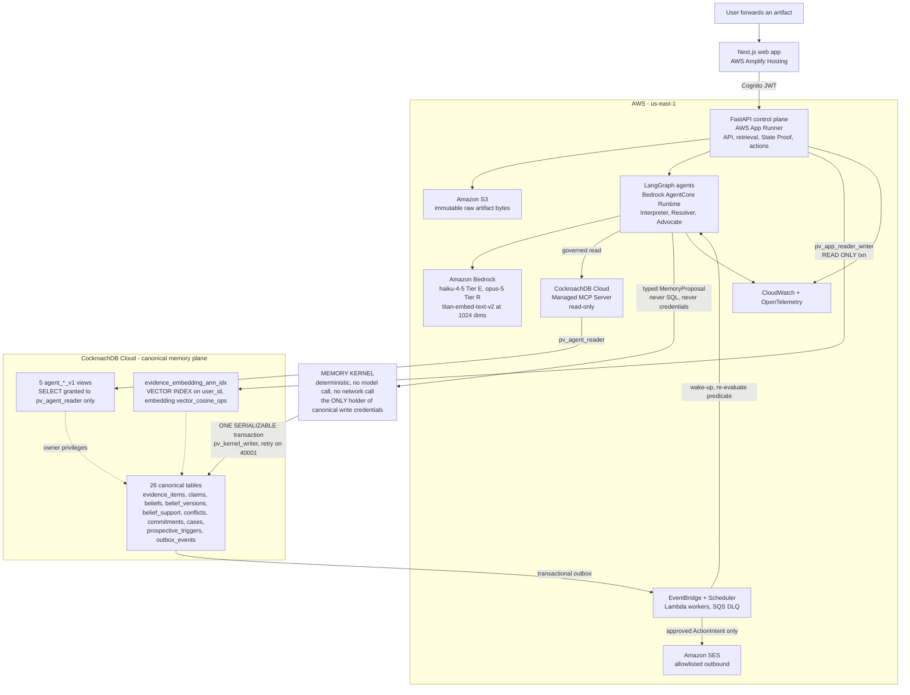

# Provenance

Purpose: the draft of the public repository `README.md` — the first artifact a hackathon judge reads — written so it can be moved to the repository root unchanged.

Status: planning complete v1.1
Implementation status: not started
Audience: hackathon judges, engineers evaluating the repository, and contributors setting up a local stack.

> **Draft note (delete this block and the five lines above when this file becomes `/README.md`).**
> Headings marked with a 🔒 must keep their exact text: `quality/23_PHASE_GATES.md` §24 greps for them (`S7`).
> Every number in the *Evaluation results* table is deliberately unfilled. Fill them at Phase 14 from
> `evals/reports/*.json`, never by hand. The final section of this file, *Risks and open questions*, is
> draft scaffolding for the design pack and does **not** ship in the README.

---

**A system of record for the institutions that already have one of you.**

Your internet provider remembers your account number, every billing period, the exact policy version in force the day you called, and the ticket ID of that call — for years, across staff turnover and system migrations. You remember a feeling, a screenshot, and a mail archive you cannot search by obligation.

Provenance closes that asymmetry for the only category where it costs real money: **unresolved obligations**. It keeps the user's side of open commitments with counterparties as versioned beliefs grounded in immutable evidence, projected into transactional state, and armed with prospective triggers — so that a promised deadline passing is itself an event.

## The technical thesis

Large language models are extraordinary at interpreting ambiguous evidence and catastrophic at being the authority on what is true. Provenance splits those jobs: **LLM agents interpret evidence and emit typed `MemoryProposal` objects; a deterministic, LLM-free Memory Kernel is the only component in the system holding SQL write credentials for canonical tables, and it commits state in one `SERIALIZABLE` CockroachDB transaction or not at all.** CockroachDB holds *both* the distributed vector index used for semantic retrieval *and* the transactional truth the application acts on, in one cluster, under one set of grants — so semantic memory and canonical state cannot drift into separate systems that disagree with each other, which is the failure mode of every "vector database plus a real database" architecture. AWS runs the agents, identity, artifacts, events, and observability; CockroachDB is the memory authority.

Four invariants hold everywhere, and every design decision that breaks one is rejected regardless of convenience:

1. **Evidence is append-only.** Admitted evidence is never rewritten or deleted; corrections arrive as new evidence.
2. **Beliefs are revisable.** A changed conclusion creates a new belief version and preserves the prior version and the reason it was superseded.
3. **State is transactional.** No case, commitment, or conflict is ever left in an impossible partial aggregate state.
4. **Actions are permissioned.** No uncommitted proposal and no agent scratchpad may produce an external side effect.

## The demo: "The Move That Never Really Ended"

Four months ago the user moved apartments. Provenance holds four relationships under one context, "The Move": the old ISP (cancellation confirmed 15 May, termination effective 31 May, case `RESOLVED`), the landlord (USD 1,800 deposit promised within 30 days of the final inspection, now past due), the moving company (USD 420 damage reimbursement, USD 200 paid, USD 220 outstanding, status `PARTIAL`), and the employer (relocation reimbursement, resolved). USD 2,020 is outstanding across the context.

A forwarded ISP invoice for USD 186 covering 1–30 June arrives. Provenance does not summarise it. It admits it as immutable evidence, types the USD 186 as a `COUNTERPARTY_CLAIM` rather than a fact, links it by exact account reference to the closed cancellation case, detects that it is mutually exclusive with the canonical `service_terminated` belief, and — in **one** serializable transaction — writes the claim, the grounding edges, a `conflicts` row, the case transition `RESOLVED → REOPENED`, the revision increment 12 → 13, the `state_transitions` row, and the outbox event. The Advocate then drafts a reply in which every factual sentence carries a support ID; a human approves it; the executor revalidates the case revision *and* the SHA-256 of the approved draft before it sends anything.

The second reveal is the one nobody asked for: the landlord deposit trigger wakes itself, because the promised 30 days elapsed while `outstanding_amount` is still USD 1,800. Nobody set a reminder.

## Architecture



The one arrow that defines the product is `AGENT → KERNEL`: it is a typed HTTP call carrying a `MemoryProposal`, not a database session. There is no edge from any agent to any canonical table, and `tools/write_path_lint` fails the build if one ever appears.

## The memory model

Ordinary retrieval-augmented generation has exactly one level of representation: the chunk. Provenance keeps six, each a distinct table with a distinct lifecycle and a distinct authority to change things. Here they are against the June invoice.

**Artifact.** The bytes that arrived. A forwarded `message/rfc822`, stored byte-for-byte in S3, identified in CockroachDB by `content_sha256` so the same forward twice is one artifact. Never edited, never re-parsed in place. Row in `source_artifacts`.

**Evidence.** Atomic, immutable, span-anchored observations extracted from the artifact — here three: a `DATE_ASSERTION` for the 1–30 June service period, an `AMOUNT_ASSERTION` for USD 186.00, an `IDENTIFIER_ASSERTION` for the account reference. Each carries its `[valid_from, valid_to)` interval, its extraction confidence, its `retraction_status`, and its 1024-dimension embedding. Rows in `evidence_items`. Evidence is never a conclusion.

**Claim.** Who asserted what, in what capacity. This is the level RAG has no representation for and the most important level in the product. The USD 186 becomes `predicate = 'balance_owed'`, `actor_type = 'COUNTERPARTY'`, `claim_kind = 'COUNTERPARTY_CLAIM'`. The invoice arriving does not make USD 186 *owed*; it makes USD 186 *claimed*, by a financially interested party, about a period beginning one day after a termination that same party confirmed in writing. Every one of those qualifiers is a column.

**Belief and lineage.** A belief is a stable proposition identity (`balance_owed` on this relationship). A *belief version* is its value at one point in the record. Version 1 said USD 0.00 with `epistemic_status = 'CONFIRMED'`. Version 2 says USD 0.00 with `epistemic_status = 'DISPUTED'` — the value did not change, our stance toward it did, which is exactly what an unresolved contradiction looks like and exactly what prose cannot express. **Lineage** is that ordered `belief_versions` supersession chain plus the recorded reason for each step.

**Grounding.** The `belief_support` edges from a belief version to the evidence and claims that back or oppose it, typed `SUPPORTS`, `CONTRADICTS`, or `QUALIFIES`. Version 2 is grounded by two `SUPPORTS` edges (the 15 May confirmation, the 31 May service-end notice) and one `CONTRADICTS` edge (the new claim). A canonical belief version must carry at least one edge unless it is a declared deterministic derivation — enforced by a `CHECK` constraint, not by discipline. *Grounding is not lineage.* Grounding is why we believe it; lineage is how the belief got here.

**Conflict.** The contradiction is materialised as a first-class row — `VALUE_CONFLICT`, `NEEDS_HUMAN`, severity `HIGH`, `requires_human` — so it is queryable, countable, and displayable rather than implicit in the edges or lost in a transcript.

**Commitment.** A promised future behaviour with an obligor, a deadline, and a fulfillment ledger: the movers' USD 420 committed, USD 200 fulfilled, USD 220 outstanding, `PARTIAL`. `outstanding_amount` is computed in Python and checked by the database (`CHECK (outstanding_amount = committed_amount - fulfilled_amount)`); a model that reasons its way to USD 220 and a constraint that refuses anything else are not the same engineering artifact.

**State.** The transactional projection the application reads and an action is permitted to cite: case status, revision, attention level, active conflicts, outstanding amounts. Either all of the June invoice's effects are true or none of them are.

## CockroachDB tools used, and precisely how 🔒

Three, all on the real path. For each, the honest question is what breaks when it is removed.

### 1. Distributed Vector Indexing — in the live retrieval path

Evidence embeddings are `amazon.titan-embed-text-v2:0` at 1024 dimensions, cosine, with the embedding version frozen at `v1` for the whole corpus. The index is **prefixed by `user_id`**, which is not a performance hint — it is the mechanism by which approximate nearest-neighbour search physically cannot return another user's evidence:

```sql
CREATE VECTOR INDEX evidence_embedding_ann_idx
    ON evidence_items (user_id, embedding vector_cosine_ops);
```

The only sanctioned query shape over-fetches inside the ANN block, then filters outside it (`provenance_db.repositories.evidence.ann_search()`):

```sql
WITH ann AS (
    SELECT id, tenant_id, artifact_id, evidence_type, normalized_text,
           observed_at, valid_from, valid_to, source_authority,
           extraction_confidence, retraction_status, embedding_version,
           embedding <=> $3 AS distance
    FROM evidence_items
    WHERE user_id = $1                  -- MUST be inside the CTE: matches the index prefix
    ORDER BY embedding <=> $3
    LIMIT $4                            -- k_raw = greatest(40, 4 * k_final)
)
SELECT id, artifact_id, evidence_type, normalized_text, observed_at,
       valid_from, valid_to, source_authority, extraction_confidence, distance
FROM ann
WHERE tenant_id = $2
  AND retraction_status = 'ACTIVE'      -- retracted vectors stay indexed; filter is mandatory
  AND embedding_version = $6
ORDER BY distance
LIMIT $5;                               -- k_final = 20 for the demo corpus
```

Two details that are correctness requirements rather than tuning. **Over-fetch is mandatory:** ANN returns candidates *before* the filters run, so `k_raw == k_final` lets a run of retracted near-neighbours silently shrink the result set. **Retraction filtering is mandatory:** retracted and superseded evidence deliberately keeps its embedding — a withdrawn invoice is the strongest support for a later dispute — so without `retraction_status = 'ACTIVE'` corrected evidence resurfaces and re-grounds beliefs the user already disowned. That failure is silent and plausible-looking, which is why it has both a golden test and a positive control that proves the golden test is not passing vacuously.

Retrieval is hybrid and ordered: exact identifiers and deterministic identity signals run *first*, and vector output is advisory context, never canonical truth. In the hero scenario the account reference resolves identity outright; the vector stage supplies the surrounding history.

**Removed:** retrieval degrades to a brute-force scan of the user's partition. The hero invoice still resolves at demo scale, latency rises, and the approach stops scaling — and if that ever happens it is disclosed in Judge Mode and in the submission, never presented as vector indexing.

### 2. CockroachDB Cloud Managed MCP Server — a genuinely governed agent read path

This is the hackathon's qualifying managed tool (distinct from the self-hosted `cockroachdb-mcp-server`). It is read-only unless `CRDB_MCP_ENABLE_WRITE_QUERIES` is set — we never set it — it forces `default_transaction_read_only = true`, it requires TLS in both directions, and it treats SQL `GRANT`s as the real permission boundary. We take that last property literally and build the boundary in the database.

The LangGraph runtime connects as `pv_agent_reader`, whose **entire** reachable surface is five views:

| View | What the agent may read |
|---|---|
| `agent_case_context_v1` | case status, revision, attention level, relationship and counterparty identity |
| `agent_active_beliefs_v1` | current belief versions flattened against their grounding edges |
| `agent_belief_lineage_v1` | the supersession chain and the reason for each step |
| `agent_evidence_retrieval_v1` | active evidence only — retracted rows are filtered inside the view |
| `agent_open_obligations_v1` | open commitments and unresolved conflicts |

`pv_agent_reader` holds **zero** base-table grants; the views execute with the owner's privileges, and the grant block ends with an explicit `REVOKE ALL` over all 26 tables plus `ALTER DEFAULT PRIVILEGES ... REVOKE ALL`, so nothing is ever granted implicitly. `users.cognito_sub`, `ingest_aliases`, `action_intents.draft_payload`, `memory_proposals.payload`, `outbox_events.payload`, `evidence_items.exact_text`, and the raw `embedding` column are absent from every view. A prompt injection that talks the model into asking for `evidence_items` gets a SQL error, not data.

MCP is visible, not plumbing: every tool call is persisted on the `agent_runs` row and rendered in the Memory Trace as a first-class node with view name, `sql_role`, `access_mode`, row count, effective beam size, and latency. Identifier parameters are hashed and the query vector renders as `vec:1024:sha256:<digest>`, so a judge sees which account reference was bound without an account number appearing on screen. **Denied calls render too, in red** — a trace that only shows successful reads is a marketing artifact.

**Removed:** the Interpreter loses its governed case-context read and falls back to the control-plane retrieval endpoint; the Memory Trace renders `MCP UNAVAILABLE — degraded read path` rather than silently succeeding.

### 3. `ccloud` CLI — provisioning and inspection

The cluster is created, listed, and inspected through `ccloud`, and the provisioning transcript is committed to `ops/cluster-provision.txt`. Phase 0 also runs eleven capability probes through `cockroach sql` and commits the raw output to `ops/cluster-probe.txt`, because CockroachDB's vector support has moved across releases: the `VECTOR` type, the `cspann` access method, the `CREATE VECTOR INDEX` alias, and the non-L2 operator classes did not all land together, and on some builds vector indexing sits behind `SET CLUSTER SETTING feature.vector_index.enabled = true`, which may be restricted on CockroachDB Cloud Basic. The probe picks the first working variant of three, and `ops/decisions/VECTOR_INDEX_VARIANT.md` records which one and why.

**Removed:** the cluster cannot be reprovisioned from scratch, and the probe evidence behind the index-variant decision disappears.

One more CockroachDB property is load-bearing and is not a "tool": **`SERIALIZABLE` isolation with bounded `40001` retry**. It is what makes "claim + belief version + grounding edges + conflict + case reopen + revision increment + state transition + outbox event" a single fact rather than eight hopeful ones. No model call and no network call is permitted inside a transaction callback; an AST-based lint enforces it.

## AWS services used, and how

| Service | Role in Provenance |
|---|---|
| **Amazon Bedrock** | Tier E `anthropic.claude-haiku-4-5` for structured extraction and classification; Tier R `anthropic.claude-opus-5` for identity resolution, contradiction characterisation, attention assessment, and advocacy drafting; `amazon.titan-embed-text-v2:0` for 1024-dimension embeddings. Routing is deterministic by node role and recorded on `agent_runs` — there is no meta-agent and no model roulette. |
| **Bedrock AgentCore Runtime** | Hosts the LangGraph ingestion, resolver, and advocate graphs. LangGraph state is ephemeral workflow state; it is never product memory. |
| **Amazon Cognito** | One human app client (`provenance-web`) and two machine-to-machine client-credentials clients (`provenance-agent-runtime`, `provenance-workers`) with scoped resource servers such as `provenance.memory/propose` and `provenance.action/execute`. A workload token cannot reach `/v1`; a browser token cannot reach `/internal/v1`. |
| **AWS App Runner** | Runs the FastAPI control plane: API, retrieval, Memory Kernel, State Proof, action policy. One container, four separate database connection pools — one per SQL role — so the role boundary is a runtime fact and not a comment. |
| **AWS Amplify Hosting** | Serves the Next.js frontend, including Judge Mode and its Memory ON/OFF counterfactual. |
| **Amazon S3** | Immutable raw artifact bytes under tenant-scoped keys. Raw evidence and derived memory stay in separate systems on purpose. |
| **Amazon Textract** | Extraction for image and PDF artifacts where MIME parsing is insufficient. |
| **Amazon SES** | Inbound forwarding address for artifacts; outbound delivery of the single supported action, restricted to an explicit recipient allowlist. |
| **Amazon EventBridge + EventBridge Scheduler** | Publishes committed outbox events; one-time schedules arm prospective triggers. The scheduler only says "look now" — the trigger predicate is always re-evaluated against current canonical state before anything fires. |
| **AWS Lambda** | SES ingest notification, Textract completion, outbox dispatch, trigger wake-up. |
| **Amazon SQS** | Dead-letter queue for poisoned events, so one bad message cannot block the queue. |
| **AWS Secrets Manager** | Every connection URL and client secret; nothing sensitive is a plaintext runtime environment value. |
| **Amazon CloudWatch + OpenTelemetry** | One `trace_id` spans artifact → interpretation → retrieval → proposal → kernel decision → transaction → outbox → advocate → approval → execution. Alarms on outbox pending age, DLQ depth, kernel retry rate, and action abort rate. |
| **AWS CDK** | All of the above as infrastructure-as-code; `cdk diff --all` must report no differences after deploy. |

Region: `us-east-1`.

## What makes this more than a demo

Each row is a guarantee, the mechanism that produces it, and the assertion that will prove it. **The assertions are written and unrun — implementation has not started** (see *Build status*), so treat this as the falsification plan, not a results table.

| Guarantee | Mechanism | Proven by |
|---|---|---|
| **No direct LLM write path** | Agents emit typed `MemoryProposal` objects over HTTP; canonical `INSERT`/`UPDATE` statements exist in exactly one module; agents connect as `pv_agent_reader`, which has no `INSERT` anywhere | `G4.3` write-path lint, `G7.3`, `G11.2` |
| **Every canonical belief is grounded** | `belief_support` edges required by a `CHECK` constraint, not by convention; `support_edge_count` reconciled against the real edge count | `G2.8`, `G4.9` sabotage, invariants V1–V3 |
| **Contradictions persist as first-class state** | `conflicts` rows with type, severity, `requires_human`, and the belief version that remains canonical — never a transient prompt string | `G4.1`, conflict-detection and false-conflict eval gates |
| **Aggregate transitions are serializable** | One `SERIALIZABLE` transaction per accepted proposal, bounded `40001` retry with jitter, no model or network call inside the callback | `G3.2`, `G3.5`, `G4.7` at 10 consecutive runs, `G14.4` at 25 |
| **Event processing is idempotent** | Transactional outbox written in the same transaction as the state change; `processed_events` dedupe by `event_id`; at-least-once assumed, exactly-once forbidden | `G10.1`, `G10.4` retry → DEAD → replay |
| **Triggers revalidate current state** | The scheduler is a wake-up, not a truth source; the predicate is re-evaluated against current canonical state and a false predicate produces a `NO_OP` **with a reason code**, never a silent one | `G10.2`, `G10.3`, `G10.6` at two frozen clocks |
| **Approvals go stale when their basis changes** | Approval binds to `basis_case_revision` **and** `approval_draft_sha256`; the executor revalidates both immediately before sending | `G9.1` stale approval aborts with zero provider calls, `G9.2` |
| **Least-privilege agent database access** | Four separated SQL roles, one connection pool each; `pv_agent_reader` reaches five views and zero tables | `G3.1`, `G11.1`, `G11.2` |
| **Raw evidence isolated from derived memory** | Bytes in S3, meaning in CockroachDB, joined only by content hash and ID | architecture principle P2; `G13.6` proves no plaintext credentials in the runtime |
| **Prompt injection has no capability path** | The Interpreter has no send tool, no write privilege, and no arbitrary SQL; a malicious PDF is admitted as evidence (invariant 1 forbids suppressing it) and reaches nothing | `G7.5`, `G14.3` — zero capability escalations, evidence preserved |
| **Measurable evals beyond one scripted flow** | 51 labelled scenarios across identity 9, temporal 8, contradiction 10, commitments 9, prospective 7, safety 8, with zero-tolerance invariant checks after *every event of every scenario* | `G14.1`, `G14.2` |
| **The tests themselves are not decoration** | A sabotage matrix neuters each invariant-bearing symbol and asserts the corresponding test selection goes red; a green sabotage run is a gate failure | `G14.6` — `UNDETECTED: 0` |

The last row is the one we would defend hardest. High test counts and coverage percentages are not evidence; a test that stays green when you break the thing it claims to protect is worse than no test, because it is a false negative you trust.

## What is seeded vs what is computed 🔒

| Thing | Status | Detail |
|---|---|---|
| 32 hero evidence items | **seeded, hand-curated** | The four "Move" relationships and their history, written by the team |
| ~18,000 decoy evidence rows | **seeded, synthetic** | Programmatically generated to make vector retrieval a real problem rather than a four-row lookup |
| 3 retraction fixtures | **seeded** | Deliberately retracted rows that keep their embeddings, used as the positive control for retraction filtering |
| 2 isolation tenants (`iso-a`, `iso-b`) | **seeded** | Exist only so cross-tenant retrieval leakage can be proven absent |
| Counterparties, accounts, addresses | **fictional** | Northline Fiber, Harborview Property Management, Beltline Movers, Kestrel Analytics, Cascade Power; `.example` domains throughout; no real person's data |
| The extraction of the June invoice | **computed at demo time** | Live Bedrock call |
| Identity resolution and retrieval | **computed at demo time** | Live exact-match plus live ANN query |
| The conflict detection | **computed at demo time** | Deterministic Kernel matcher |
| The case reopen and revision increment | **computed at demo time** | One serializable transaction against the live cluster |
| The trigger evaluation | **computed at demo time** | Predicate re-evaluated against current state |
| The advocacy draft | **computed at demo time** | Live Bedrock call, grounded against the committed State Proof |
| The Memory Trace and Judge Mode panels | **rendered from persisted rows and spans** | No scripted animation, no hard-coded identifiers |

A fixture mode exists for deterministic local tests and as an emergency fallback. When it is on, a non-dismissible banner says so and `GET /v1/version` reports `fixture_mode: true` and `agent_mode: "FIXTURE"`. The recorded submission runs with `fixture_mode: false`, and that is checked as a pass/fail submission item.

## Quickstart

### Prerequisites

- Python 3.12, Node.js 20 or newer, `make`
- `cockroach` SQL CLI, `ccloud` CLI, `jq`, `gh`, `gitleaks`
- A CockroachDB Cloud organisation
- An AWS account in `us-east-1` with Bedrock model access granted for `anthropic.claude-opus-5`, `anthropic.claude-haiku-4-5`, and `amazon.titan-embed-text-v2:0`

### 1. Clone and bootstrap

```bash
git clone https://github.com/<org>/provenance.git
cd provenance
make bootstrap          # creates the venv, installs the four provenance_* packages and apps/web
make lint
```

### 2. Provision the cluster and run the capability probes

```bash
ccloud auth login
ccloud cluster create basic --name provenance --cloud aws --region us-east-1 \
  | tee ops/cluster-provision.txt
ccloud cluster list --output json | jq -r '.[] | .name + " " + .state'
# → "provenance CREATED"
```

The exact `ccloud` flag set for the plan you choose is captured verbatim in `ops/cluster-provision.txt`; treat that transcript, not this README, as the record. Then run the eleven vector/computed-column probes and commit their output:

```bash
make db-probe           # writes ops/cluster-probe.txt, selects the vector index variant
grep -E "^VARIANT: (A|B|C)$" ops/decisions/VECTOR_INDEX_VARIANT.md
```

If the probe reports that vector indexing is gated, run `SET CLUSTER SETTING feature.vector_index.enabled = true;` as `pv_migrator` and re-run the probe. If it is unavailable on your plan, the build still runs on the documented brute-force fallback — and says so in the UI.

### 3. Configure

Copy `.env.example` to `.env`. The settings object (`provenance_contracts/settings.py`) **raises on any missing required value and never defaults a credential**, so a misconfigured stack fails at startup rather than at the demo. Connection URLs and client secrets resolve from AWS Secrets Manager at call time and never enter a shell history or a log.

### 4. Migrate, seed, run

```bash
alembic upgrade head     # migrations 0001-0008: 26 tables, 5 views, 5 roles, the vector index
make db-verify           # → "V1 0  V2 0 ... V10 0  V11 3"   (V11 is a positive control)
make seed                # hero corpus + ~18,000 synthetic decoys; idempotent
make dev                 # control plane on :8080, web on :3000
```

`make seed` caches the seed corpus vectors in `db/seeds/vectors.parquet` on first generation, so reseeding does not re-invoke Bedrock for 18,000 embeddings.

Sign in with the seeded judge account, open **The Move**, and forward `demo_data/the_move/E3_isp_invoice.json` — or upload the `.eml` — to watch the case reopen.

## Running the tests

```bash
make test                          # the commit lane: unit + contract + db + adversarial + retrieval
pytest -m unit -q --cov --cov-fail-under=95
pytest -m "db and not slow" -q -n 4
pytest -m e2e -q                   # real Kernel, real database, stub external sinks
PV_FORBID_MOCKS=1 pytest tests/e2e -q   # the e2e conftest refuses any unittest.mock import
make sabotage                      # neuter each guarded symbol; every mapped selection must go red
make gate-4                        # any single phase battery, by number, 0 through 15
python -m evals.run --suite all --assert-thresholds
```

Markers: `unit`, `db`, `contract`, `live_model`, `retrieval`, `e2e`, `adversarial`, `concurrency`, `isolation`, `slow`, `golden`. `--strict-markers` and `filterwarnings = ["error"]` are on, so an unregistered marker or a new deprecation fails the build rather than scrolling past.

The Memory Kernel is **never** mocked in a correctness test. Commit assertions re-read over a second connection opened after the transaction closed — an in-transaction read-back is not evidence of a commit and is rejected at review.

## Evaluation results

The corpus is 51 hand-labelled scenarios — identity 9, temporal 8, contradiction 10, commitments 9, prospective 7, safety 8 — in `evals/datasets/memory_cases.jsonl`, runnable in three modes: `KERNEL_REPLAY` (stored proposal → Kernel → database, no Bedrock), `PIPELINE_LIVE` (artifact → LangGraph → Kernel → database, real models), and `COUNTERFACTUAL` (one artifact, memory OFF and ON).

Targets below are frozen. **Results are filled at Phase 14 from `evals/reports/*.json` and are not filled here, because nothing has been run.** Lowering a threshold to make a suite pass requires a written justification naming who approved it and why the new number is still honest.

| Gate | Target | Class | Result |
|---|---|---|---|
| Invariant violations (15 queries, after every event) | 0 | zero-tolerance | *to be filled at Phase 14* |
| `harmful_confidence_rate` | 0.00 | zero-tolerance | *to be filled at Phase 14* |
| `evidence_must_not_include` violations | 0 | zero-tolerance | *to be filled at Phase 14* |
| Human-routing recall | 1.00 | zero-tolerance | *to be filled at Phase 14* |
| Draft grounding rate | 1.00 | zero-tolerance | *to be filled at Phase 14* |
| Prospective false-wake rate | 0.00 | zero-tolerance | *to be filled at Phase 14* |
| Forbidden reason codes | 0 | zero-tolerance | *to be filled at Phase 14* |
| Kernel decision accuracy (`KERNEL_REPLAY`) | 1.00 | gate | *to be filled at Phase 14* |
| State transition + revision-delta accuracy (`KERNEL_REPLAY`) | 1.00 | gate | *to be filled at Phase 14* |
| Commitment arithmetic exactness | 1.00 | gate | *to be filled at Phase 14* |
| Trigger outcome accuracy | 1.00 | gate | *to be filled at Phase 14* |
| Exact-identifier hit rate | 1.00 | gate | *to be filled at Phase 14* |
| Case top-1 accuracy | ≥ 0.95 | gate | *to be filled at Phase 14* |
| Abstention recall | ≥ 0.90 | gate | *to be filled at Phase 14* |
| Conflict detection recall | ≥ 0.90 | gate | *to be filled at Phase 14* |
| False-conflict rate | ≤ 0.05 | gate | *to be filled at Phase 14* |
| Disposition accuracy | ≥ 0.90 | gate | *to be filled at Phase 14* |
| Grounding-edge exactness | ≥ 0.95 | gate | *to be filled at Phase 14* |
| Lineage exactness | ≥ 0.95 | gate | *to be filled at Phase 14* |
| Amount / currency accuracy | ≥ 0.98 | gate | *to be filled at Phase 14* |
| Date normalisation accuracy | ≥ 0.95 | gate | *to be filled at Phase 14* |
| Claim-kind F1 | ≥ 0.90 | gate | *to be filled at Phase 14* |
| Adversarial containment matrix | 15/15 | gate | *to be filled at Phase 14* |
| Sabotage matrix detection | `UNDETECTED: 0` | gate | *to be filled at Phase 14* |

Why some targets are 1.00 and others are not: `KERNEL_REPLAY` is a pure function of (fixture, database, config), so anything below 1.00 there is a bug rather than variance. `PIPELINE_LIVE` allows 0.95 because the proposal itself is model-generated. The zero-tolerance rows are existence checks over finite sets, not estimates — there is no confidence interval available to argue with.

## Build status

**Implementation has not started.** This repository currently contains the design pack: product definition, architecture, memory system, executable database and contract specifications, kernel and retrieval algorithms, byte-exact prompts, API and trigger contracts, the test strategy, the 51-scenario evaluation corpus, and 16 phase gates (`G-0` … `G-15`) with machine-checkable exit assertions.

No cloud resource has been provisioned, no test has been run, and no number in this README has been measured. Every phase is signed by a named reviewer who is not the builder, with verbatim command output attached, in `ops/gates/PHASE_00.md` … `PHASE_15.md`. A phase reported complete without pasted output is automatically reopened and its battery re-run by someone else.

## Repository layout

```text
provenance/
├── apps/web/                          Next.js + TypeScript; dashboard, State Proof, Judge Mode
├── services/control_plane/            FastAPI container on App Runner
│   └── app/
│       ├── api/                       public /v1 surface
│       ├── auth/                      Cognito JWT -> Principal, capability objects
│       ├── ingestion/                 artifact registration and de-duplication
│       ├── retrieval/                 structured identity + vector retrieval
│       ├── memory_kernel/             THE ONLY canonical write path in the repository
│       ├── state_proof/               deterministic explanation read model, SQL only
│       ├── actions/                   intents, approval, revalidation, execution
│       └── events/                    outbox helpers
├── agents/runtime/                    LangGraph graphs, nodes, prompts, model router, MCP tools
├── workers/                           ses_ingest, textract_complete, outbox_dispatch, trigger_wakeup
├── packages/python/
│   ├── provenance_contracts/          versioned Pydantic boundary models + typed settings
│   ├── provenance_domain/             enums, state machines, money, invariant functions
│   ├── provenance_db/                 one pool per SQL role, repositories, 40001 retry wrapper
│   └── provenance_telemetry/          trace IDs, OTEL helpers
├── db/
│   ├── migrations/                    Alembic 0001-0008
│   ├── seeds/                         MANIFEST.json, vectors.parquet, deterministic IDs
│   └── verify.sql                     V1-V11 post-migration verification queries
├── infra/
│   ├── cdk/                           Cognito, S3, SES, EventBridge, SQS, Lambda, App Runner, ECR
│   └── agentcore/                     AgentCore Runtime configuration
├── evals/                             datasets, retrieval, extraction, memory, adversarial, reports
├── demo_data/the_move/                the hero scenario artifacts
├── tests/                             unit, db, kernel, retrieval, actions, events, triggers,
│                                      mcp, api, adversarial, e2e
├── ops/
│   ├── cluster-provision.txt          ccloud transcript
│   ├── cluster-probe.txt              P1-P11 capability probe output
│   ├── decisions/                     VECTOR_INDEX_VARIANT.md, LICENSE_SHA.txt
│   └── gates/                         PHASE_00.md ... PHASE_15.md, SUBMISSION.md, scrubbed logs
├── tools/                             gate.sh, scrub.py, write_path_lint, txn_purity_lint,
│                                      fixture_guard, invariant_map_check
└── docs/                              the design pack
```

## Licence

Apache License 2.0. See [`LICENSE`](LICENSE) for the full text and [`NOTICE`](NOTICE) for attribution.

```
Copyright 2026 The Provenance Authors

Licensed under the Apache License, Version 2.0 (the "License");
you may not use this file except in compliance with the License.
You may obtain a copy of the License at

    http://www.apache.org/licenses/LICENSE-2.0

Unless required by applicable law or agreed to in writing, software
distributed under the License is distributed on an "AS IS" BASIS,
WITHOUT WARRANTIES OR CONDITIONS OF ANY KIND, either express or implied.
See the License for the specific language governing permissions and
limitations under the License.
```

## Tool usage disclosure 🔒

Submitted for the CockroachDB × AWS Hackathon — Build with Agentic Memory. Disclosed in full, including the parts that are less flattering.

**AI assistance used to build Provenance.** This project was designed and implemented with heavy AI assistance. Anthropic's Claude, driven through Claude Code, was used to draft and revise the entire design pack in `docs/`, to generate implementation code, to write tests, and to act as a fresh-context reviewer at phase gates. Design documents and code were reviewed and edited by a human before being committed. This disclosure is not a formality: a substantial fraction of the prose and the code in this repository originated from a model. The controls we rely on for correctness are mechanical rather than authorial — strict typing, database `CHECK` constraints, the sabotage matrix, the fixture guard, and the evidence-before-assertion rule at every gate — precisely because "a careful author wrote it" is not a claim we can make.

**AI models used at runtime, inside the product.** `anthropic.claude-haiku-4-5` (Tier E structured extraction and classification), `anthropic.claude-opus-5` (Tier R semantic resolution, contradiction characterisation, attention assessment, advocacy drafting), and `amazon.titan-embed-text-v2:0` (1024-dimension embeddings), all invoked through Amazon Bedrock. Routing is deterministic by graph-node role and recorded on every `agent_runs` row.

**CockroachDB tooling.** CockroachDB Cloud Managed MCP Server (governed read path for the agents, `pv_agent_reader`, read-only, five views); `ccloud` CLI (provisioning and inspection); `cockroach` SQL CLI (migrations, capability probes, verification queries). Distributed Vector Indexing is a database capability we depend on, exercised through the retrieval query above.

**Other third-party services.** Amazon Web Services (services enumerated above); CockroachDB Cloud; GitHub for source hosting and CI; Devpost for submission. Development tooling includes `ruff`, `mypy`, `pytest`, `hypothesis`, `alembic`, `playwright`, `gitleaks`, and `AWS CDK`.

**Synthetic data.** All demonstration data is synthetic. The 32 hero evidence items were hand-written by the team; the ~18,000 decoy evidence rows were generated programmatically to make retrieval a real problem. Every counterparty is fictional (Northline Fiber, Harborview Property Management, Beltline Movers, Kestrel Analytics, Cascade Power), every domain is a `.example` domain, every account reference is invented, and no real person's correspondence, account, or personal data appears anywhere in the repository or the demo. The seeded judge account exists solely for evaluation.

**What is not ours.** Apache-2.0 dependencies are attributed in `NOTICE`. No CockroachDB or AWS code has been copied into this repository; both are used as services through their public interfaces.

## Known limitations

We would rather you read these from us than find them yourself.

1. **Nothing is built yet.** Every assertion in this README is a plan with a written command behind it, not a measured result. See *Build status*.
2. **Vector index availability is not guaranteed on CockroachDB Cloud Basic.** It sits behind a cluster setting that may be restricted on that plan. The Phase 0 probe decides; the fallback is a brute-force scan of the user's partition, which is survivable at demo scale, does not scale, and would be disclosed rather than dressed up.
3. **MCP tenant scoping is not a database-enforced boundary.** A view cannot force its caller to supply a `user_id` predicate. On the MCP path, scoping is enforced by the AgentCore tool wrapper — which binds `user_id` from the agent run's principal, never from the model — plus a post-hoc row audit that fails the run closed if a foreign row is ever returned. Row-level security would move this into the database; that feature's availability on the provisioned cluster has not been verified, so we do not claim it. The trusted isolation path is the control plane.
4. **Source-authority scores are engineering judgement presented in a table.** The predicate-aware authority bands are hand-set numbers, not empirical calibration. The Kernel uses explicit rules for high-value predicates and treats the numeric band as a tiebreaker rather than an oracle, and the evaluation corpus scores conflict *outcomes*, not scores.
5. **51 hand-labelled scenarios cannot calibrate production performance.** The corpus is a deterministic regression suite. We deliberately did not template-generate variants to inflate the sample size into an illusion of statistical precision.
6. **Business days mean Monday to Friday with no holiday calendar.** Extraction surfaces a `BUSINESS_DAY_CALENDAR_ASSUMED` flag rather than pretending otherwise.
7. **Ingestion is forward-and-upload only.** No Gmail mailbox OAuth. That turns a demo into a compliance project and puts the whole ingestion surface on a review path we cannot complete in the hackathon window.
8. **Exactly one external action type exists:** a single outbound email, human-approved, bound to a case revision and a draft hash, restricted to an allowlisted recipient. No payments, no dispute filings, no chargebacks. Sending is the only irreversible operation in the system, which is why it sits behind four controls and a human click.
9. **Provenance does not adjudicate.** It asserts what the record contains and cites it. It does not tell you what you are legally entitled to, and it will not interpret contested policy language.
10. **Multi-tenancy is proven by test, not visible in the UI.** Isolation tenants exist so cross-tenant vector leakage can be shown absent; the demo user only ever sees one tenant. Technically low risk, rhetorically weaker than a screenshot.
11. **EventBridge Scheduler runs on AWS wall time and cannot be frozen.** The deployed trigger is exercised by setting `not_before` into the past, which tests the evaluator thoroughly and the scheduler's own timing not at all. That gap is real.
12. **Single-region AWS compute.** CockroachDB's multi-region capability is described truthfully as the production topology; standing up active-active application compute for a demo-scale workload would be theatre.
13. **Lawful deletion and data-residency requirements are architecturally reserved, not implemented.** Tombstones, belief recomputation on erased grounding, and tenant-scoped S3 paths exist in the design; GDPR/CCPA erasure flows do not.
14. **The counterfactual toggle is our most persuasive asset and the easiest to accuse of being rigged.** Memory OFF runs the identical graph, model, prompt, and artifact, differing only in that retrieval returns empty and the State Proof is empty. The two request payloads are byte-diffable on demand; ask and we will show them.

---

## Risks and open questions

*Draft-only. This section does not ship in `/README.md`.*

**R1 — The README asserts capabilities that Phase 0 has not yet verified.** The vector-index syntax, the `feature.vector_index.enabled` setting on Basic, view/grant behaviour for `pv_agent_reader`, and Bedrock model access for both canonical model IDs are all execution-time facts. *Decision:* every such claim in this draft is written against the predetermined fallback in `CANONICAL_DECISIONS.md`, and limitation 2 states the fallback plainly. At Phase 15 this file must be re-read line by line against `ops/cluster-probe.txt`; any sentence the probe contradicts is rewritten, not softened.

**R2 — Length.** This README is long for a document a judge reads first. The mitigation is ordering: the hook, the thesis, the demo, and the diagram all land before any table. *Open question:* whether to split the AWS table, the repository layout, and the eval table into `SUBMISSION.md` and keep the README under roughly 200 lines. Recommendation: decide after the first outside reader times how long they spend before scrolling past the diagram.

**R3 — The guarantee table cites gate IDs for gates that have never been run.** A judge who reads `G4.3` as a result rather than as a plan would be misled. *Mitigation:* the table's preamble and the *Build status* section both say so explicitly. *Residual risk:* moderate — someone skimming the table alone will still misread it. Consider a per-row `status` column once gates begin signing.

**R4 — The tool-usage disclosure is unusually candid about AI authorship.** It is honest, and honesty is the correct posture; it also hands a sceptical judge a ready-made criticism. *Decision:* keep it. The rebuttal is in the same paragraph — the correctness controls are mechanical, not authorial — and a disclosure that a judge discovers on their own is far more damaging than one they were handed.

**R5 — Resolved.** The hero case-reopen reason code is **`CONTRADICTORY_EVIDENCE`**. `specs/11_CONTRACTS.md` owns enum membership (`CANONICAL_DECISIONS.md`, *Closed domain vocabularies*) and `CASE_REOPEN_REASON_CODES` contains exactly that spelling; it is also a **guard** on the `RESOLVED → REOPENED` transition, so the two variants previously in circulation (`CONTRADICTORY_EVIDENCE_ADMITTED` in `G4.1` and `specs/10_DATABASE_DDL.md` §18, `RC_CONTRADICTORY_EVIDENCE` in `00_PRODUCT.md` §2.3) would have raised `IllegalTransition` rather than merely reading oddly. All three were corrected. This README may now name the code.

**R6 — `ccloud` subcommand flags in *Quickstart* are written from documentation, not from a run.** The `create basic` flag set in particular may differ by plan and CLI version. *Mitigation:* the text tells the reader to treat `ops/cluster-provision.txt` as the record. *Action:* replace the block verbatim with the Phase 0 transcript once it exists.

**R7 — "≥ 2 CockroachDB tools, genuinely used" is a judgement, not a measurement.** Each of the three tools here states what breaks when it is removed, which is the best available proxy. A judge may reasonably hold a stricter standard — for instance, that MCP must be on the critical path rather than a governed read path with a control-plane fallback. *Posture:* state what each tool does and what its removal costs; claim no depth the degradation test does not support.

**R8 — Open question: judge credentials in a public README.** §24 `S3` requires judge login to work from a clean browser profile, which implies published credentials in a public repository. That is a deliberate, scoped exposure of a seeded demo account with no real data, but it is still a credential in a public repo and `gitleaks` may flag the pattern. *Recommendation:* publish the judge account on the Devpost submission page and the demo URL's login screen, link to it from the README, and keep the literal password out of the repository so `S8` stays clean.
